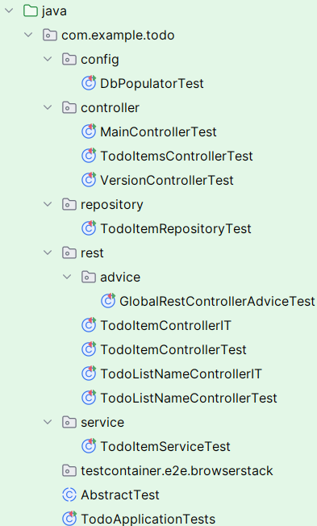
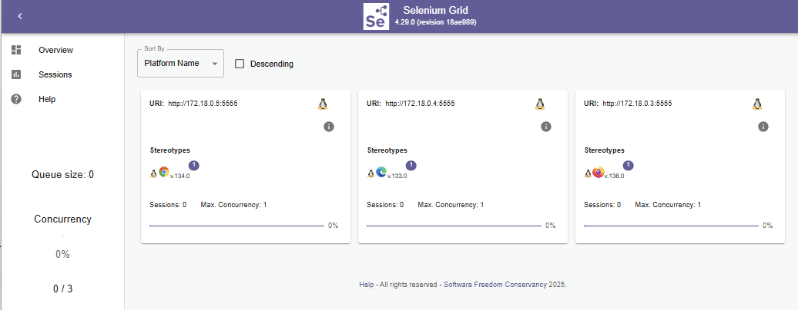

# Spring Boot (v 3.4.2) To-Do List Application

## Content

- [Setup the Project](#setup-spring-initializr)
- [Build the Backend](#create-the-data-model)
- [Build the Frontend](#implement-client)
- [Deploy the Application with Docker](#creating-and-deploying-a-container)
- [Install Traefik Reverse Proxy on a remote Ubuntu Linux System](traefik/README.md)
- [Unit Tests](#unit-tests)
- [Selenium Tests with Test Container](#selenium-tests-with-test-container)

## Overview

This is a Spring Boot MVC application for managing To-Do lists and their items. The frontend is implemented using Thymeleaf and jQuery, while the backend exposes a REST API for managing To-Do lists and items.

## Features

- **To-Do List Management:**
    - Create, rename, and delete To-Do lists.
    - View all To-Do lists on the main page.
- **To-Do Item Management:**
    - View, add, edit, and delete items within a selected To-Do list.
    - Toggle the completion status of items.
- **Navigation:**
    - Click on a To-Do list to navigate to its items page.
    - A back button allows returning to the main page.
- **Testing:**
    - Comprehensive unit tests for controllers and services.

## Technologies Used

- **Backend:** Spring Boot, Spring MVC, Spring Data JPA
- **Frontend:** Thymeleaf, jQuery, HTML, CSS
- **Database:** H2 (in-memory, for development/testing)
- **API Specification:** OpenAPI
- **Testing:** JUnit, Mockito
- **Containerization:** Docker

## Installation

### Prerequisites

- Java 17+
- Maven 3.8+
- Docker (for containerized deployment)

### Step 1: Clone the Repository

```sh
git clone https://github.com/mbachmann/spring-boot-todo-app.git
cd spring-boot-todo-app
```

### Step 2: Build the Backend

Compile and package the Spring Boot application:

```sh
mvn clean install
```

Run the application locally:

```sh
mvn spring-boot:run
```

The application will start on `http://localhost:8080/`.

### Step 3: Build the Frontend

The frontend is integrated with Thymeleaf templates and does not require a separate build step. Ensure the application is running, and access it via the browser at `http://localhost:8080/`.

### Step 4: Run Tests

Execute unit tests using:

```sh
mvn test
```

### Step 5: Deploy with Docker

To build and run the application in a Docker container:

```sh
docker build -t spring-boot-todo-app .
docker run -p 8080:8080 spring-boot-todo-app
```

## Usage

### Main Page (`index.html`)

- Displays all To-Do lists.
- Buttons to create, rename, and delete To-Do lists.
- Clicking a list navigates to its items page.

### To-Do Items Page (`todo-items.html`)

- Displays all items of a selected To-Do list.
- Options to add, edit, delete, and mark items as done.
- Back button to return to the main page.

## API Endpoints

### To-Do Lists
- `GET /api/v1/todolist-names` - Retrieve all To-Do list names.
- `GET /api/v1/todolist-names/{id}` - Retrieve a specific To-Do list name.
- `POST /api/v1/todolist-names` - Create a new To-Do list name.
- `PUT /api/v1/todolist-names/{id}` - Rename a To-Do list name.
- `DELETE /api/v1/todolist-names/{id}` - Delete a To-Do list name.

### To-Do Items
- `GET /api/v1/todo-items/item/{itemId}` - Retrieve a specific item.
- `GET /api/v1/todo-items/list/{listId}` - Retrieve items of a list.
- `GET /api/v1/todo-items/listids` - Retrieve all To-Do list IDs.
- `GET /api/v1/todo-items/list` - Retrieve all To-Do lists.
- `POST /api/v1/todo-items/new` - Add a new item.
- `PUT /api/v1/todo-items/edit` - Edit an item.
- `DELETE /api/v1/todo-items/delete/{id}` - Delete an item.
- `PUT /api/v1/todo-items/state/{id}` - Toggle an item's completion status.

## Contribution

Contributions are welcome! Please fork the repository and create a pull request with your improvements.

## License

This project is licensed under the MIT License.

## Author

Maintained by [mbachmann](https://github.com/mbachmann).


<br/>
## Content

- [Setup the project](#setup-spring-initializr)
- [Build the backend](#create-the-data-model)
- [Build the frontend](#implement-client)
- [Deploy the application with docker](#creating-and-deploying-a-container)

## Overview

We will implement simple Todo List app, with client using jQuery and backend use Spring Boot REST APIs.
This tutorial has been adapted from the blog post:

[https://blog.facebit.net/2019/03/25/install-spring-boot-on-mac/](https://blog.facebit.net/2019/03/25/install-spring-boot-on-mac/)

The difference to the original is a changed technology stack.

<br/>


<br/>

## Tools and Technology Stack

the project has been created by using IntelliJ Ultimate edition.
The technology stack consists of the following components:

- Spring Boot (Version 3.4.2)
- Java Persistence API
- Rest Controller
- Thymeleaf Template Engine
- HTML, CSS, jQuery, Single Page Application
- H2 and MySQL (8.x) Database
- H2 Console
- OpenApi
- Docker and Docker Compose

<br/>

## Setup Spring Initializr

_IntelliJ IDEA_ provides the _Spring Initializr_ project wizard that integrates with the _Spring Initializr
API_ to generate and import your project directly from the _IDE_.

_Spring Initializr_ generates a valid project structure with the following files:

- A build configuration file, for example, _build.gradle_ for _Gradle_ or _pom.xml_ for _Maven_.
- A class with the _main()_ method to bootstrap the application.
- An empty _JUnit_ test class.
- An empty Spring application configuration file: _application.properties_

Choose Java SDK (can be 17, 21, etc):

<br/>


<br />

Choose the dependencies like _Spring Web_, _Spring Data JPA_, _Thymeleaf_ and _SQL H2 Data Base_:

<br/>


<br />

Add the following libraries to the _pom.xml_ file:

```xml
  <dependency>
     <groupId>org.springframework.boot</groupId>
     <artifactId>spring-boot-starter-validation</artifactId>
  </dependency>
     <!-- Open API  -->
  <dependency>
    <groupId>org.springdoc</groupId>
    <artifactId>springdoc-openapi-starter-webmvc-ui</artifactId>
    <version>2.8.5</version>
  </dependency>

```

For the testing we need the ability for creating Mocks. We have to add Mockito the _pom.xml_:

```xml
  <dependency>
    <groupId>org.mockito</groupId>
    <artifactId>mockito-core</artifactId>
    <scope>test</scope>
  </dependency>
```

The Mockito dependency requires a plugin:

```xml
<plugin>
  <groupId>org.apache.maven.plugins</groupId>
  <artifactId>maven-surefire-plugin</artifactId>
  <configuration>
    <argLine>
      -javaagent:${settings.localRepository}/org/mockito/mockito-core/${mockito.version}/mockito-core-${mockito.version}.jar
      -Xshare:off
    </argLine>
  </configuration>
</plugin>
```

For the extraction of information from the _pom.xml_ file, we need the following dependency:

```xml
     <dependency>
         <groupId>org.apache.maven</groupId>
         <artifactId>maven-model</artifactId>
         <version>3.9.6</version>
      </dependency>
```

We can add information about our source code repository and maven build stamp to the _pom.xml_ file:

```xml
   <url/>
   <licenses>
      <license/>
   </licenses>
   <developers>
      <developer/>
   </developers>
   <scm>
      <connection>scm:git:https://github.com/mbachmann/spring-boot-todo-app</connection>
      <developerConnection>scm:git:https://github.com/mbachmann/spring-boot-todo-app</developerConnection>
      <url>https://github.com/mbachmann/spring-boot-todo-app</url>
   </scm>
   <description>Demo project for Spring Boot</description>
   <properties>
      <java.version>21</java.version>
      <maven.build.timestamp.format>yyyyMMdd-HHmm</maven.build.timestamp.format>
   </properties>
```

The _pom.xml_ file should look like this:

[pom.xml](pom.xml)

**Do not forget the maven refresh!!**

The spring-boot plugin allows to start the project.

<br/>


<br/>

## The project structure

The final structure of the project consists of files for the backend in main/java and files for the web application
in resources folder. The project has beside the basic profile three additional spring profiles (dev, h2 and mysql).
The _Dockerfile_ allows you to create a deployable container. The docker-compose files are demonstrating how to configure
and orchestrate the containers.

<br/>

The final project structure is as follows:


<br/>

## Create the HasLogger Interface

The _HasLogger_ interface is used to provide a logger for the classes. Create the package _utils_ in the _src/main/java_ folder.

Add the code to HasLogger.java file.

```java
package com.example.todo.utils;

import org.slf4j.Logger;
import org.slf4j.LoggerFactory;

/**
 * HasLogger is a feature interface that provides Logging capability for anyone
 * implementing it where logger needs to operate in serializable environment
 * without being static.
 */
public interface HasLogger {

    default Logger getLogger() {
        return LoggerFactory.getLogger(getClass());
    }
}

```
<br/>

## Create the Data Model

The model class is used to create the database table and also to serialize the json information. We can create a new package with name _model_ in the _src/main/java_ folder.

The _TodoItem.java_ class is an entity class that is mapped to the database table.

```java
package com.example.todo.model;

import jakarta.persistence.*;
import jakarta.validation.constraints.NotEmpty;
import org.hibernate.annotations.JdbcTypeCode;
import org.hibernate.annotations.Type;
import org.hibernate.type.SqlTypes;

import java.time.Instant;
import java.util.UUID;


@Entity
public class TodoItem {

  public TodoItem() {}

  public TodoItem(UUID listId, String taskName, Instant createdAt) {
    this.listId = listId;
    this.taskName = taskName;
    this.createdAt = createdAt;
  }

  @Id
  @GeneratedValue(strategy= GenerationType.AUTO)
  private Long itemId;

  private UUID listId;

  @NotEmpty(message="* Enter Task Name")
  private String taskName;

  private Boolean isDone = false; // Default value

  private Instant createdAt = Instant.now();

  public Long getItemId() {
    return itemId;
  }

  public void setItemId(Long itemId) {
    this.itemId = itemId;
  }

  public UUID getListId() {
    return listId;
  }

  public void setListId(UUID listId) {
    this.listId = listId;
  }

  public String getTaskName() {
    return taskName;
  }

  public void setTaskName(String taskName) {
    this.taskName = taskName;
  }


  public Boolean getDone() {
    return isDone;
  }

  public void setDone(Boolean done) {
    isDone = done;
  }

  public Instant getCreatedAt() {
    return createdAt;
  }

  public void setCreatedAt(Instant createdAt) {
    this.createdAt = createdAt;
  }
}

```

The class has the following annotations:


Annotations:

- **@Table**, This annotation specifies the primary table for the annotated entity.
- **@Id**, Specifies database table primary key of a mapped entity.
- **@GeneratedValue**, specification of generation strategies for the values of primary keys. it takes IDENTITY and AUTO as value.
- **@Column**, Specifies database table mapped column for a persistent property or field.
- **@GeneratedType**, Defines the types of primary key generation strategies.
- **@NotEmpty**, The annotated element must not be null nor empty. Supported types are: CharSequence, Collection, Map and Array
- **@Email** The string has to be a well-formed email address.

<br/>

The _TodoItemList.java_ interface is a projection that can be used to extract an aggregated database information.

```java
package com.example.todo.model;

import java.time.Instant;
import java.util.UUID;

public interface TodoItemList    {
    UUID getListId();
    int getCount();
    Instant getFromDate();
    Instant getToDate();
}

```

It counts the number of items in a list and provides the listId and the creation from and to date range.

<br/>

The _TodoListName.java_ class is an entity class that is mapped to the database table.

```java
package com.example.todo.model;

import jakarta.persistence.Entity;
import jakarta.persistence.Id;
import jakarta.validation.constraints.NotNull;

import java.util.UUID;

@Entity
public class TodoListName {

    @NotNull
    @Id
    private UUID id;

    @NotNull
    private String name;

    public TodoListName() {
        this.id = UUID.randomUUID();
    }

    public TodoListName(UUID id, String name) {
        this.id = id;
        this.name = name;
    }

    public TodoListName(String name) {
        this();
        this.name = name;
    }

    public UUID getId() {
        return id;
    }

    public void setId(UUID id) {
        this.id = id;
    }

    public String getName() {
        return name;
    }

    public void setName(String name) {
        this.name = name;
    }
}

```

Explanation of the code:

- The id has a data type of UUID. The UUID is a 128-bit number used to identify information in computer systems. 
  The UUID is unique and can be used to identify a list. The name is a string that is used to identify the list.
- The name is a string that is used to identify the list.

<br/>

##  Create the Repository for the model

The query builder mechanism built into Spring Data repository infrastructure is useful for building constraining
queries over entities of the repository.


Adding TodoItemRepository.java

```java
package com.example.todo.repository;

import com.example.todo.model.TodoItem;
import com.example.todo.model.TodoItemList;
import org.springframework.data.jpa.repository.JpaRepository;
import org.springframework.data.jpa.repository.Query;
import org.springframework.stereotype.Repository;

import java.util.List;
import java.util.Optional;
import java.util.UUID;

@Repository
public interface TodoItemRepository extends JpaRepository<TodoItem, Long> {

  TodoItem findByItemId(Long itemId);

  List<TodoItem> findByListId(UUID listId);

  @Query("select distinct listId from TodoItem ")
  List<UUID> findDistinctListId();

  void deleteByListId(UUID listId);

  @Query("select  t.listId as listId, count(t.itemId) as count, min(t.createdAt) as fromDate, max(t.createdAt) as toDate  from TodoItem t where t.listId is not null group by t.listId")
  List<TodoItemList> getAllTodoListDetails();

  @Query("select  t.listId as listId, count(t.itemId) as count, min(t.createdAt) as fromDate, max(t.createdAt) as toDate  from TodoItem t where t.listId = :listId group by t.listId")
  Optional<TodoItemList> findTodoListDetailsByListId(UUID listId);

  List<TodoItem> findByTaskName(String taskName);
  List<TodoItem> findByTaskNameAndListId(String taskName, UUID listId);
}

```

The _TodoItemRepository_ interface extends the _JpaRepository_ interface. The _JpaRepository_ interface has methods for
CRUD operations. The _TodoItemRepository_ interface has additional methods for finding items by listId, taskName and
deleting items by listId.

<br/>

Adding _TodoListNameRepository.java_:

```java
package com.example.todo.repository;


import com.example.todo.model.TodoListName;
import org.springframework.data.jpa.repository.JpaRepository;
import org.springframework.stereotype.Repository;

import java.util.List;
import java.util.UUID;

@Repository
public interface TodoListNameRepository extends JpaRepository<TodoListName, UUID> {

    List<TodoListName> findByName(String name);
}

```

<br/>

## Create the DTO's

The Data Transfer Objects provide some additional serialization opportunities for the todo item data.

<br/>

### TodoItemListsDTO

The DTO is providing an object with a count and a list of uuid's.

```json
{
  "count": 2,
  "todoItemList": [
    "4cfb7b98-ef1e-43c5-9681-9fc6def818d3",
    "75f1c193-c8cb-4c85-97b9-980cc7a36b2e"
  ]
}
```

Create a package _dto_ in the _src/main/java_ folder.

Add the code to TodoItemListsDTO.java file.

```java
package com.example.todo.dto;

import java.util.List;
import java.util.UUID;

public class TodoItemListsDTO {

  private int count;
  private List<UUID> todoItemList;

  public TodoItemListsDTO(){}

  public TodoItemListsDTO(int count, List<UUID> todoItemList){
    this.count = count;
    this.todoItemList = todoItemList;
  }

  public int getCount() {
    return count;
  }

  public void setCount(int count) {
    this.count = count;
  }

  public List<UUID> getTodoItemList() {
    return todoItemList;
  }

  public void setTodoItemList(List<UUID> todoItemList) {
    this.todoItemList = todoItemList;
  }
}
```

The _TodoItemListsDTO_ class has the following attributes:

- **count**, the number of items in the list.
- **todoItemList**, a list of UUID's.
- **getCount()**, returns the count.
- **setCount()**, sets the count.
- **getTodoItemList()**, returns the list of UUID's.
- **setTodoItemList()**, sets the list of UUID's.

<br/>

### TodoItemsDTO

The DTO is providing a grouped structure of the todo items.

```json
[
  {
    "count": 3,
    "listId": "87bd261d-f044-4f08-ba09-24ecf6d9ab33",
    "fromDate": "2025-02-25T06:48:01.416522Z",
    "toDate": "2025-03-02T06:48:01.416529Z",
    "listName": "To-Do List for business",
    "todoItemList": [
      {
        "itemId": 1,
        "listId": "87bd261d-f044-4f08-ba09-24ecf6d9ab33",
        "taskName": "Create a project plan",
        "createdAt": "2025-02-25T06:48:01.416522Z",
        "done": false
      },
      {
        "itemId": 2,
        "listId": "87bd261d-f044-4f08-ba09-24ecf6d9ab33",
        "taskName": "Refactor the project java code",
        "createdAt": "2025-03-02T06:48:01.416527Z",
        "done": false
      },
      {
        "itemId": 3,
        "listId": "87bd261d-f044-4f08-ba09-24ecf6d9ab33",
        "taskName": "Organize a code review meeting",
        "createdAt": "2025-03-02T06:48:01.416529Z",
        "done": false
      }
    ]
  },
  {
    "count": 3,
    "listId": "6a385567-02b8-444a-b3ae-ab7701269a7f",
    "fromDate": "2025-02-25T06:48:01.430684Z",
    "toDate": "2025-03-02T06:48:01.430688Z",
    "listName": "To-Do List for homework",
    "todoItemList": [
      {
        "itemId": 4,
        "listId": "6a385567-02b8-444a-b3ae-ab7701269a7f",
        "taskName": "Write a summary of the last lesson",
        "createdAt": "2025-02-25T06:48:01.430684Z",
        "done": false
      },
      {
        "itemId": 5,
        "listId": "6a385567-02b8-444a-b3ae-ab7701269a7f",
        "taskName": "Code the Java homework",
        "createdAt": "2025-03-02T06:48:01.430687Z",
        "done": false
      },
      {
        "itemId": 6,
        "listId": "6a385567-02b8-444a-b3ae-ab7701269a7f",
        "taskName": "Review the java solution code",
        "createdAt": "2025-03-02T06:48:01.430688Z",
        "done": false
      }
    ]
  },
  {
    "count": 3,
    "listId": "a8f92e07-f9a8-49b2-93f4-f924b58bdef0",
    "fromDate": "2025-02-25T06:48:01.435033Z",
    "toDate": "2025-03-02T06:48:01.435039Z",
    "listName": "To-Do List for private",
    "todoItemList": [
      {
        "itemId": 7,
        "listId": "a8f92e07-f9a8-49b2-93f4-f924b58bdef0",
        "taskName": "Meet my friend in the city",
        "createdAt": "2025-02-25T06:48:01.435033Z",
        "done": false
      },
      {
        "itemId": 8,
        "listId": "a8f92e07-f9a8-49b2-93f4-f924b58bdef0",
        "taskName": "Go to grocery store",
        "createdAt": "2025-03-02T06:48:01.435038Z",
        "done": false
      },
      {
        "itemId": 9,
        "listId": "a8f92e07-f9a8-49b2-93f4-f924b58bdef0",
        "taskName": "Call Mam",
        "createdAt": "2025-03-02T06:48:01.435039Z",
        "done": false
      }
    ]
  },
  {
    "count": 0,
    "listId": "7b425ec6-4895-4a75-93d4-faa3f523a879",
    "fromDate": null,
    "toDate": null,
    "listName": "An empty To-Do List",
    "todoItemList": []
  }
]
```

The file TodoItemsDTO.java

```java
package com.example.todo.dto;

import com.example.todo.model.TodoItem;

import java.time.Instant;
import java.util.List;
import java.util.UUID;

public class TodoItemsDTO {

  private int count;
  private UUID listId;
  private Instant fromDate;
  private Instant toDate;
  private String listName;
  private List<TodoItem> todoItemList;

  public TodoItemsDTO(){}

  public TodoItemsDTO(int count, UUID listId, Instant fromDate, Instant toDate, String listName, List<TodoItem> todoItemList){
    this.count = count;
    this.listId = listId;
    this.fromDate = fromDate;
    this.toDate = toDate;
    this.listName = listName;
    this.todoItemList = todoItemList;
  }

  public int getCount() {
    return count;
  }

  public void setCount(int count) {
    this.count = count;
  }

  public UUID getListId() {
    return listId;
  }

  public void setListId(UUID listId) {
    this.listId = listId;
  }

  public List<TodoItem> getTodoItemList() {
    return todoItemList;
  }

  public void setTodoItemList(List<TodoItem> todoItemList) {
    this.todoItemList = todoItemList;
  }

  public Instant getFromDate() {
    return fromDate;
  }

  public void setFromDate(Instant fromDate) {
    this.fromDate = fromDate;
  }

  public Instant getToDate() {
    return toDate;
  }

  public void setToDate(Instant toDate) {
    this.toDate = toDate;
  }

  public String getListName() {
    return listName;
  }

  public void setListName(String listName) {
    this.listName = listName;
  }
}


```

The _TodoItemsDTO_ class has the following attributes:

- **count**, the number of items in the list.
- **listId**, the id of the list.
- **fromDate**, the creation date of the first item in the list.
- **toDate**, the creation date of the last item in the list.
- **listName**, the name of the list.
- **todoItemList**, a list of todo items.

<br/>

### TodoListNameDTO

The DTO is providing a list of todo list names.

```json
[
  {
    "id": "87bd261d-f044-4f08-ba09-24ecf6d9ab33",
    "name": "To-Do List for business"
  },
  {
    "id": "6a385567-02b8-444a-b3ae-ab7701269a7f",
    "name": "To-Do List for homework"
  },
  {
    "id": "a8f92e07-f9a8-49b2-93f4-f924b58bdef0",
    "name": "To-Do List for private"
  },
  {
    "id": "7b425ec6-4895-4a75-93d4-faa3f523a879",
    "name": "An empty To-Do List"
  }
]
```

The class TodoListNameDTO.java

```java
package com.example.todo.dto;

import java.time.Instant;
import java.util.UUID;

public class TodoListNameDTO {

    private int count;
    private UUID listId;
    private Instant fromDate;
    private Instant toDate;
    private String listName;

    public TodoListNameDTO(){}

    public TodoListNameDTO(int count, UUID listId, Instant fromDate, Instant toDate, String listName){
        this.count = count;
        this.listId = listId;
        this.fromDate = fromDate;
        this.toDate = toDate;
        this.listName = listName;
    }

    public int getCount() {
        return count;
    }

    public void setCount(int count) {
        this.count = count;
    }

    public UUID getListId() {
        return listId;
    }

    public void setListId(UUID listId) {
        this.listId = listId;
    }

    public Instant getFromDate() {
        return fromDate;
    }

    public void setFromDate(Instant fromDate) {
        this.fromDate = fromDate;
    }

    public Instant getToDate() {
        return toDate;
    }

    public void setToDate(Instant toDate) {
        this.toDate = toDate;
    }

    public String getListName() {
        return listName;
    }

    public void setListName(String listName) {
        this.listName = listName;
    }
}

``` 

The _TodoListNameDTO_ class has the following attributes:

- **count**, the number of items in the list.
- **listId**, the id of the list.
- **fromDate**, the creation date of the first item in the list.
- **toDate**, the creation date of the last item in the list.
- **listName**, the name of the list.

<br/>

## Create the Services

The service class is used to implement the business logic. The service class is used to implement the business logic.

Create a package _service_ in the _src/main/java_ folder.

Adding TodoItemService.java

```java
package com.example.todo.service;


import com.example.todo.dto.TodoItemListsDTO;
import com.example.todo.dto.TodoItemsDTO;
import com.example.todo.model.TodoItem;
import com.example.todo.model.TodoItemList;
import com.example.todo.model.TodoListName;
import com.example.todo.repository.TodoItemRepository;
import com.example.todo.repository.TodoListNameRepository;
import jakarta.transaction.Transactional;
import org.springframework.beans.factory.annotation.Autowired;
import org.springframework.stereotype.Service;

import java.time.Instant;
import java.time.ZoneId;
import java.time.format.DateTimeFormatter;
import java.util.ArrayList;
import java.util.List;
import java.util.Optional;
import java.util.UUID;

@Service
public class TodoItemService {

  private final TodoItemRepository todoItemRepository;
  private final TodoListNameRepository todoListNameRepository;

  @Autowired
  public TodoItemService(TodoItemRepository todoItemRepository, TodoListNameRepository todoListNameRepository) {
    this.todoItemRepository = todoItemRepository;
    this.todoListNameRepository = todoListNameRepository;
  }

  public TodoItem saveTodoItem(TodoItem item) {

    Optional<TodoListName> tln = todoListNameRepository.findById(item.getListId());
    if (tln.isEmpty()) {
      long count = todoListNameRepository.count();
      String formattedDate = DateTimeFormatter.ofPattern("yyyy-MM-dd")
              .withZone(ZoneId.systemDefault())
              .format(Instant.now());
      todoListNameRepository.save(new TodoListName(item.getListId(), "New List " + (count + 1) + " from " + formattedDate));
    }
    return todoItemRepository.save(item);

  }

  public TodoItem changeDoneStateForTodoItem(Long id) {
    TodoItem item = todoItemRepository.findByItemId(id);
    if (item != null) {
      item.setDone(!item.getDone());
      todoItemRepository.save(item);
      return item;
    }
    return null;
  }

  public Boolean deleteTodoItem(Long id) {
    TodoItem item = todoItemRepository.findById(id).orElse(null);
    if (item != null) {
      todoItemRepository.delete(item);
      return true;
    }
    return false;
  }

  public TodoItem editTodoItem(TodoItem editedItem) {
    TodoItem item = todoItemRepository.findById(editedItem.getItemId()).orElse(null);
    if (item != null) {
      item.setTaskName(editedItem.getTaskName());
      return todoItemRepository.save(item);
    }
    //Create new if we dont have.
    return todoItemRepository.save(item);
  }

  public List<TodoItem> getAllTodoItemsForListId(UUID listId) {
    return todoItemRepository.findByListId(listId);
  }

  /**
   * Return a DTO containing a list of UUID's and the count
   *
   * @return the TodoItemListsDTO
   */
  public TodoItemListsDTO getTodoItemListIDs() {
    List<UUID> listIds = todoItemRepository.findDistinctListId();
    return new TodoItemListsDTO(listIds.size(), listIds);
  }

  /**
   * Return a DTO containing a list of todoLists including a count, name, from and to Date
   *
   * @return the List<TodoItemsDTO>
   */
  public List<TodoItemsDTO> getTodoItemLists() {
    List<TodoItemsDTO> todoItemsDTOs = new ArrayList<>();
    List<TodoItem> todoItems = todoItemRepository.findAll();
    List<TodoItemList> todoListDetails = todoItemRepository.getAllTodoListDetails();
    List<TodoListName> todoListNames = todoListNameRepository.findAll();

    todoListNames.forEach(todoListName -> {
      List<TodoItem> todoItemsForOneList = todoItems.stream().filter(ti -> ti.getListId().equals(todoListName.getId())).toList();
      todoListDetails.stream().filter(til -> til.getListId().equals(todoListName.getId())).findFirst()
              .ifPresentOrElse(todoListDetail -> {
                todoItemsDTOs.add(new TodoItemsDTO(
                        todoItemsForOneList.size(),
                        todoListDetail.getListId(),
                        todoListDetail.getFromDate(),
                        todoListDetail.getToDate(),
                        todoListName.getName(),
                        todoItemsForOneList));
              }, () -> {
                todoItemsDTOs.add(new TodoItemsDTO(
                        todoItemsForOneList.size(),
                        todoListName.getId(),
                        null,
                        null,
                        todoListName.getName(),
                        todoItemsForOneList));
              });
    });
    return todoItemsDTOs;
  }

  /**
   * Return a DTO containing a list of todoLists including a count, name, from and to Date
   *
   * @return the TodoItemsDTO
   */
  public TodoItemsDTO getTodoItemList(UUID listId) {
    TodoItemsDTO todoItemsDTO = new TodoItemsDTO();
    todoListNameRepository.findById(listId).ifPresent(todoListName -> {
      List<TodoItem> todoItems = todoItemRepository.findByListId(listId);
      todoItemRepository.findTodoListDetailsByListId(listId).ifPresentOrElse(todoListDetail -> {
        todoItemsDTO.setCount(todoItems.size());
        todoItemsDTO.setListId(listId);
        todoItemsDTO.setFromDate(todoListDetail.getFromDate());
        todoItemsDTO.setToDate(todoListDetail.getToDate());
        todoItemsDTO.setListName(todoListName.getName());
        todoItemsDTO.setTodoItemList(todoItems);

      }, () -> {
        todoItemsDTO.setCount(todoItems.size());
        todoItemsDTO.setListId(listId);
        todoItemsDTO.setFromDate(null);
        todoItemsDTO.setToDate(null);
        todoItemsDTO.setListName(todoListName.getName());
        todoItemsDTO.setTodoItemList(todoItems);
      });
    });
    return todoItemsDTO;
  }


  public TodoItem getItem(Long id) {
    return todoItemRepository.findById(id).orElse(null);
    // return todoItemRepository.findByItemId(id);
  }

  @Transactional
  public void deleteByListId(UUID listId) {
    todoItemRepository.deleteByListId(listId);
  }
}

```

The _TodoItemService_ class has the following methods:

- **saveTodoItem()**, saves a todo item.
- **changeDoneStateForTodoItem()**, changes the done state of a todo item.
- **deleteTodoItem()**, deletes a todo item.
- **editTodoItem()**, edits a todo item.
- **getAllTodoItemsForListId()**, gets all todo items for a list id.
- **getTodoItemListIDs()**, gets a list of todo item list id's.
- **getTodoItemLists()**, gets a list of todo items.
- **getTodoItemList()**, gets a list of todo items for a list id.
- **getItem()**, gets a todo item.
- **deleteByListId()**, deletes a list by list id.

<br/>

## Create the DbPopulator

The _DbPopulator_ class is used to populate the database with some initial data.

Create a package _config_ in the _src/main/java_ folder.

Adding DbPopulator.java

```java
package com.example.todo.config;

import com.example.todo.model.TodoItem;
import com.example.todo.model.TodoListName;
import com.example.todo.repository.TodoItemRepository;
import com.example.todo.repository.TodoListNameRepository;
import com.example.todo.utils.HasLogger;
import org.springframework.context.annotation.Configuration;
import org.springframework.core.env.Environment;

import java.time.Instant;
import java.util.ArrayList;
import java.util.Arrays;
import java.util.List;

@Configuration
public class DbPopulator implements HasLogger {
    private final Environment environment;
    private final TodoListNameRepository todoListNameRepository;
    private final TodoItemRepository todoItemRepository;
    private List<TodoListName> todoListNames;
    private List<TodoItem> todoItems;

    private static final String PRIVATE_LIST = "To-Do List for private";
    private static final String BUSINESS_LIST = "To-Do List for business";
    private static final String HOMEWORK_LIST = "To-Do List for homework";
    private static final String EMTPY_LIST = "An empty To-Do List";


    public DbPopulator(Environment environment, TodoListNameRepository todoListNameRepository, TodoItemRepository todoItemRepository) {
        this.environment = environment;
        this.todoListNameRepository = todoListNameRepository;
        this.todoItemRepository = todoItemRepository;
        if (Boolean.TRUE.equals(environment.getProperty("auto-populate-db", Boolean.class))) {
            initDB();
        }
    }

    private void initDB() {
        getLogger().info("Init DB");
        createTodoListNames();
        createTodoListForBusiness();
        createTodoListForHomework();
        createTodoListForPrivate();

    }

    private void createTodoListNames() {
        getLogger().info("Init DB - create 4 TodoListNames");
        todoListNames = new ArrayList<>(Arrays.asList(
                new TodoListName(BUSINESS_LIST),
                new TodoListName(HOMEWORK_LIST),
                new TodoListName(PRIVATE_LIST),
                new TodoListName(EMTPY_LIST)
        ));
        todoListNames.forEach(
                tln -> todoListNameRepository.findByName(tln.getName()).stream().findFirst().ifPresentOrElse(
                        found -> getLogger().info("Init DB - TodoListName already exists: {}", found.getName()),
                        () -> todoListNameRepository.save(tln)));
        todoListNames = todoListNameRepository.findAll();
    }

    private void createTodoListForBusiness() {
        todoListNames.stream().filter(tln -> tln.getName().equals(BUSINESS_LIST)).findFirst().ifPresent(tln -> {
            todoItems = new ArrayList<>(Arrays.asList(
                    new TodoItem(tln.getId(), "Create a project plan", Instant.now().minusSeconds(3600 * 24 * 10)),
                    new TodoItem(tln.getId(), "Refactor the project java code", Instant.now().minusSeconds(3600 * 24 * 5)),
                    new TodoItem(tln.getId(), "Organize a code review meeting", Instant.now().minusSeconds(3600 * 24 * 5))
            ));
            saveTodoItems(todoItems);
        });
    }


    private void createTodoListForHomework() {
        todoListNames.stream().filter(tln -> tln.getName().equals(HOMEWORK_LIST)).findFirst().ifPresent(tln -> {
            todoItems = new ArrayList<>(Arrays.asList(
                    new TodoItem(tln.getId(), "Write a summary of the last lesson", Instant.now().minusSeconds(3600 * 24 * 10)),
                    new TodoItem(tln.getId(), "Code the Java homework", Instant.now().minusSeconds(3600 * 24 * 5)),
                    new TodoItem(tln.getId(), "Review the java solution code", Instant.now().minusSeconds(3600 * 24 * 5))
            ));
            saveTodoItems(todoItems);
        });
    }

    private void createTodoListForPrivate() {
        todoListNames.stream().filter(tln -> tln.getName().equals(PRIVATE_LIST)).findFirst().ifPresent(tln -> {
            todoItems = new ArrayList<>(Arrays.asList(
                    new TodoItem(tln.getId(), "Meet my friend in the city", Instant.now().minusSeconds(3600 * 24 * 10)),
                    new TodoItem(tln.getId(), "Go to grocery store", Instant.now().minusSeconds(3600 * 24 * 5)),
                    new TodoItem(tln.getId(), "Call Mam", Instant.now().minusSeconds(3600 * 24 * 5))
            ));
            saveTodoItems(todoItems);
        });
    }

    private void saveTodoItems(List<TodoItem> todoItems) {
        todoItems.forEach(todoItem -> {
            todoItemRepository.findByTaskNameAndListId(todoItem.getTaskName(), todoItem.getListId()).stream().findFirst().ifPresentOrElse(
                    found -> getLogger().info("Init DB - TodoItem already exists: {}", found.getTaskName()),
                    () -> todoItemRepository.save(todoItem)
            );
        });
    }
}

```

The _DbPopulator_ class has the following methods:

- **initDB()**, initializes the database.
- **createTodoListNames()**, creates the todo list names: To-Do List for private, To-Do List for business, To-Do List for homework, An empty To-Do List.
- **createTodoListForBusiness()**, creates todo list for business.
- **createTodoListForHomework()**, creates todo list for homework.
- **createTodoListForPrivate()**, creates todo list for private.
- **saveTodoItems()**, saves todo items.
- **createTodoListForEmpty()**, creates an empty todo list.

<br/>


## Create the REST Controllers

### TodoItemController

This is REST Controller for CRUD operations of the todo items.

Create a package _rest_ in the _src/main/java_ folder.

Adding TodoItemController.java

```java
package com.example.todo.rest;

import com.example.todo.dto.TodoItemListsDTO;
import com.example.todo.dto.TodoItemsDTO;
import com.example.todo.model.TodoItem;
import com.example.todo.rest.advice.ResourceNotFoundException;
import com.example.todo.service.TodoItemService;
import org.springframework.http.ResponseEntity;
import org.springframework.web.bind.annotation.*;

import java.util.List;
import java.util.UUID;

@RestController
@RequestMapping("/api/v1")
public class TodoItemController {


  private final TodoItemService todoItemService;

  public TodoItemController(TodoItemService todoItemService) {
    this.todoItemService = todoItemService;
  }

  @GetMapping("/item/{itemId}")
  public TodoItem getItem(@PathVariable Long itemId) {
    TodoItem  todoItem = todoItemService.getItem(itemId);
    if (todoItem == null) throw new ResourceNotFoundException("List item with id=" + itemId + " not found");
    return todoItem;
  }

  // Get todo list, based on listId
  @GetMapping("/list/{listId}")
  public List<TodoItem> getItemsOfOneList(@PathVariable UUID listId) {
    return todoItemService.getAllTodoItemsForListId(listId);
  }

  // Get all todo listIds
  @GetMapping("/listids")
  public TodoItemListsDTO getListIDs() {
    return todoItemService.getTodoItemListIDs();
  }

  // Get all todo lists
  @GetMapping("/list")
  public List<TodoItemsDTO> getAllTodoItems() {
    return todoItemService.getTodoItemLists();
  }


  // New todo item
  @PostMapping(value = "/new")
  public ResponseEntity<TodoItem> newTodoItem(@RequestBody TodoItem item) {
    return ResponseEntity.ok(todoItemService.saveTodoItem(item));
  }

  // Edit todo item
  @PutMapping("/edit")
  public ResponseEntity<TodoItem> editTodoItem(@RequestBody TodoItem item) {
    return ResponseEntity.ok(todoItemService.editTodoItem(item));
  }

  // Delete todo item
  @DeleteMapping("/delete/{id}")
  public ResponseEntity<Boolean> deleteTodoItem(@PathVariable Long id) {
    if (!todoItemService.deleteTodoItem(id)) throw new ResourceNotFoundException("Delete not successful: List item with id=" + id + " not found");
    return ResponseEntity.ok(true);
  }

  // Change done state
  @PutMapping("/state/{id}")
  public ResponseEntity<TodoItem> changeDoneState(@PathVariable Long id) {
    TodoItem  todoItem = todoItemService.changeDoneStateForTodoItem(id);
    if (todoItem == null) throw new ResourceNotFoundException("ChangeDoneState not successful: List item with id=" + id + " not found");
    return ResponseEntity.ok(todoItem);
  }
}

```

Published end points:

- PUT /api/v1/state/{id}
- PUT /api/v1/edit
- POST /api/v1/new
- GET /api/v1/list
- GET /api/v1/listids
- GET /api/v1/list/{listId}   listId is a uuid eg. 3fa85f64-5717-4562-b3fc-2c963f66afa6
- GET /api/v1/item/{itemId}
- DELETE /api/v1/delete/{id}

<br/>

### TodoListNameController

This is REST Controller for CRUD operations of the todo list names.

Adding TodoListNameController.java

```java
package com.example.todo.rest;


import com.example.todo.dto.TodoItemsDTO;
import com.example.todo.dto.TodoListNameDTO;
import com.example.todo.model.TodoListName;
import com.example.todo.repository.TodoListNameRepository;
import com.example.todo.service.TodoItemService;
import org.springframework.beans.factory.annotation.Autowired;
import org.springframework.http.ResponseEntity;
import org.springframework.web.bind.annotation.*;

import java.util.List;
import java.util.Optional;
import java.util.UUID;

@RestController
@RequestMapping("/api/v1/todolist-names")
public class TodoListNameController {


    private final TodoListNameRepository todoListNameRepository;
    private final TodoItemService todoItemService;

    @Autowired
    public TodoListNameController(TodoListNameRepository todoListNameRepository, TodoItemService todoItemService) {
        this.todoListNameRepository = todoListNameRepository;
        this.todoItemService = todoItemService;
    }

    @GetMapping
    public List<TodoListNameDTO> getAllTodoListNames() {
        List<TodoItemsDTO> todoItemsDTOs =  todoItemService.getTodoItemLists();

        return todoItemsDTOs.stream()
                .map(tid -> new TodoListNameDTO(
                        tid.getCount(), tid.getListId(), tid.getFromDate(), tid.getToDate(), tid.getListName())
                ).toList();
    }

    @GetMapping("/{id}")
    public ResponseEntity<TodoListNameDTO> getTodoListNameById(@PathVariable UUID id) {

        TodoItemsDTO todoItemsDTO =  todoItemService.getTodoItemList(id);
        if (todoItemsDTO == null || todoItemsDTO.getListId() == null) {
            return ResponseEntity.notFound().build();
        } else {
            TodoListNameDTO todoListNameDTO = new TodoListNameDTO(
                    todoItemsDTO.getCount(), todoItemsDTO.getListId(), todoItemsDTO.getFromDate(), todoItemsDTO.getToDate(), todoItemsDTO.getListName()
            );
            return ResponseEntity.ok(todoListNameDTO);
        }

    }

    @PostMapping
    public TodoListName createTodoListName(@RequestBody TodoListName todoListName) {
        return todoListNameRepository.save(todoListName);
    }

    @PutMapping("/{id}")
    public ResponseEntity<TodoListName> updateTodoListName(@PathVariable UUID id, @RequestBody TodoListName todoListNameDetails) {
        Optional<TodoListName> todoListName = todoListNameRepository.findById(id);
        if (todoListName.isPresent()) {
            TodoListName updatedTodoListName = todoListName.get();
            updatedTodoListName.setName(todoListNameDetails.getName());
            return ResponseEntity.ok(todoListNameRepository.save(updatedTodoListName));
        } else {
            return ResponseEntity.notFound().build();
        }
    }

    @DeleteMapping("/{id}")
    public ResponseEntity<Void> deleteTodoListName(@PathVariable UUID id) {
        Optional<TodoListName> todoListName = todoListNameRepository.findById(id);
        if (todoListName.isPresent()) {
            todoItemService.deleteByListId(id);
            todoListNameRepository.delete(todoListName.get());
            return ResponseEntity.noContent().build();
        } else {
            return ResponseEntity.notFound().build();
        }
    }
}
``` 

Published end points:

- DELETE /api/v1/todolist-names/{id}
- PUT /api/v1/todolist-names/{id}
- POST /api/v1/todolist-names
- GET /api/v1/todolist-names/{id}
- GET /api/v1/todolist-names

<br/>

### Adding the ResourceNotFoundException

The _ResourceNotFoundException_ class is used to handle the exception when a resource is not found.

Create the package _rest.advice_ in the _src/main/java_ folder.

Adding ResourceNotFoundException.java

```java
package com.example.todo.rest.advice;

public class ResourceNotFoundException extends RuntimeException {

    public ResourceNotFoundException(String message) {
        super(message);
    }

}

```

<br/>

## The TodoApplication

We are producing some console output, configuring openApi and configuring cors.

```java
package com.example.todo;

import io.swagger.v3.oas.models.Components;
import io.swagger.v3.oas.models.OpenAPI;
import io.swagger.v3.oas.models.info.Info;
import io.swagger.v3.oas.models.info.License;
import io.swagger.v3.oas.models.servers.Server;
import jakarta.annotation.PostConstruct;
import org.springframework.beans.factory.annotation.Autowired;
import org.springframework.beans.factory.annotation.Value;
import org.springframework.boot.SpringApplication;
import org.springframework.boot.autoconfigure.SpringBootApplication;
import org.springframework.context.annotation.Bean;
import org.springframework.core.env.Environment;
import org.springframework.web.cors.CorsConfiguration;
import org.springframework.web.cors.UrlBasedCorsConfigurationSource;
import org.springframework.web.filter.CorsFilter;

import java.util.Arrays;

@SpringBootApplication
public class TodoApplication {

  @Autowired
  private Environment env;

  public static void main(String[] args) {
    SpringApplication.run(TodoApplication.class, args);
  }

  @PostConstruct
  public void afterInit() {
    boolean hasDevProfile = Arrays.asList(env.getActiveProfiles()).contains("dev");
    boolean hasH2Database = Arrays.asList(env.getActiveProfiles()).contains("h2");
    String appUrl = env.getProperty("todoapp.server");
    String applicationName = env.getProperty("spring.application.name");
    String openApiInfo="";
    String h2ConsoleInfo="";
    if (hasDevProfile) {
      openApiInfo = appUrl + "/v3/api-docs\n" +
              appUrl + "/v3/api-docs.yaml -> yaml file is downloaded -> https://editor.swagger.io/\n" +
              appUrl + "/swagger-ui.html \n";
    }
    if (hasH2Database) {
      h2ConsoleInfo= appUrl + "/h2-console  " + "" +
              "-> mit Generic H2 (Embedded), org.h2.Driver, jdbc:h2:mem:testdb und sa \n";
    }
    System.out.println("\n\nApplication [" + applicationName + "] - Enter in Browser:\n" + appUrl + " \n" +
            openApiInfo +
            h2ConsoleInfo + "\n" +
            "Active Profiles: " + Arrays.toString(env.getActiveProfiles()) + "\n\n");
  }

  @Bean
  public OpenAPI customOpenAPI(@Value("${springdoc.version}") String appVersion, @Value("${todoapp.server}") String contextPath) {
    return new OpenAPI()
            .addServersItem(new Server().url(contextPath))
            .components(new Components())
            .info(new Info().title("API for Todo App").version(appVersion)
                    .license(new License().name("Apache 2.0").url("http://springdoc.org")));
  }

  @Bean
  public CorsFilter corsFilter() {
    final UrlBasedCorsConfigurationSource source = new UrlBasedCorsConfigurationSource();
    final CorsConfiguration config = new CorsConfiguration();
    config.setAllowCredentials(false);
    config.addAllowedOrigin("*");
    config.addAllowedHeader("Authorization");
    config.addAllowedHeader("X-AUTH-TOKEN");
    config.addAllowedHeader("Content-Type");
    config.addAllowedMethod("OPTIONS");
    config.addAllowedMethod("GET");
    config.addAllowedMethod("POST");
    config.addAllowedMethod("PUT");
    config.addAllowedMethod("DELETE");
    config.addAllowedMethod("PATCH");
    source.registerCorsConfiguration("/**", config);
    return new CorsFilter(source);
  }

}

```

The _TodoApplication_ class has the following methods:

- **main()**, starts the application.
- **afterInit()**, prints the application url, openApi and h2 console info.
- **customOpenAPI()**, creates the OpenAPI.
- **corsFilter()**, creates the CorsFilter.

Instead of using the _@CrossOrigin_ annotation at REST controller class level, we are using the _CorsFilter_ to allow all origins.
The _CorsFilter_ is configured to allow all origins, headers and methods.

<br/>

## Create the Profiles

### Change the application.properties

The _application.properties_ file contains the generic properties. Through the property
_spring.profiles.active=${ACTIVE_PROFILES:dev,h2}_ we can choose which profiles we
want to add.


```properties
spring.profiles.active=${ACTIVE_PROFILES:dev,postgres}
server.port=8080

spring.application.name=${APP_NAME:Todo Application}

# spring.liquibase.change-log=classpath:/db/changelog/db.changelog-master.yaml

springdoc.api-docs.enabled=false

todoapp.server=${APP_URL:http://localhost:8080}

auto-populate-db=true


```

<br/>

### Create an application-dev.properties

The _application-dev.properties_ consists of the properties for the configuration of the _Spring OpenApi_.

```properties

springdoc.remove-broken-reference-definitions=false
springdoc.version=@springdoc.version@
springdoc.default-produces-media-type=application/json

springdoc.swagger-ui.path=/swagger-ui.html
springdoc.swagger-ui.enabled=true
springdoc.swagger-ui.operations-sorter=alpha
springdoc.swagger-ui.tags-sorter=alpha
springdoc.swagger-ui.doc-expansion=none

springdoc.api-docs.enabled=true
springdoc.api-docs.version=openapi_3_0
springdoc.api-docs.path=/v3/api-docs
springdoc.api-docs.resolve-extensions-properties=true

```

<br/>

### Create an application-h2.properties

The _application-h2.properties_ are configuring the H2 database including the _h2-console_.

```properties

spring.jpa.hibernate.ddl-auto=create-drop
spring.jpa.database-platform=org.hibernate.dialect.H2Dialect
spring.jpa.open-in-view=false
spring.jpa.properties.hibernate.id.new_generator_mappings=false

spring.datasource.driverClassName=org.h2.Driver
# spring.datasource.url=jdbc:h2:file:./data/testdb
spring.datasource.url=jdbc:h2:mem:testdb
spring.datasource.username=sa
spring.datasource.password=

spring.h2.console.enabled=true
spring.h2.console.settings.web-allow-others=true


```

<br/>

### Create an application-mysql.properties

The _application-mysql.properties_ are configuring the MySql database. The url
contains options to:

- create the database if it is not existing
- allow the public key retrieval (mandatory for MySQL8.x)
- UTF-8 character encoding

```properties
spring.jpa.hibernate.ddl-auto=update
spring.jpa.open-in-view=false
spring.jpa.properties.hibernate.id.new_generator_mappings=false
spring.jpa.properties.hibernate.dialect=org.hibernate.dialect.MySQLDialect

spring.datasource.driverClassName=com.mysql.cj.jdbc.Driver
spring.datasource.url=jdbc:mysql://${APP_DB_HOST:localhost}:${APP_DB_PORT:3306}/${APP_DB_NAME:todoapp}?useUnicode=true&characterEncoding=utf8&useSSL=false&allowPublicKeyRetrieval=true&serverTimezone=UTC&useLegacyDatetimeCode=false&createDatabaseIfNotExist=true
spring.datasource.username= ${APP_DB_USERNAME:root}
spring.datasource.password=${APP_DB_PASSWORD:password}

```

<br/>

## Implement the Frontend Client with Thymeleaf

We will use Thymeleaf for rendering client template and using Javascript/jQuery to call REST APIs.
The controller is delivering the index.html. For each new session a unique uuid is created. Each
user gets its onw list.

Create a package _controller_ in the _src/main/java_ folder.

In controllers folder, adding MainController.java.

```java
package com.example.todo.controller;

import org.springframework.stereotype.Controller;
import org.springframework.ui.Model;
import org.springframework.web.bind.annotation.RequestMapping;
import org.springframework.web.bind.annotation.RequestMethod;

import java.util.UUID;

@Controller
public class MainController {

  /**
   * This method is used to return the index page.
   * @param model Model object to pass data to the view.
   * @return index in order to load index-template.html from the templates' folder.
   */
  @RequestMapping(value = { "/", "/index" }, method = RequestMethod.GET)
  public String index(Model model)
  {
    // When people visit site, create an UUID for a list and return it.
    UUID uuid = UUID.randomUUID();
    model.addAttribute("listId", uuid.toString());
    return "index-template";
  }
}


```

Explanation:

- **index()**, returns the index-template page.
- **UUID.randomUUID()**, creates a random UUID.
- **model.addAttribute("listId", uuid.toString())**, adds the UUID to the model.
- 

In controllers folder, adding TodoItemsController.java.

```java
package com.example.todo.controller;

import org.springframework.stereotype.Controller;
import org.springframework.ui.Model;
import org.springframework.web.bind.annotation.GetMapping;
import org.springframework.web.bind.annotation.RequestParam;

@Controller
public class TodoItemsController {

    /**
     * This method is used to return the todo-items page.
     * @param listId The listId of the todo list to get loaded.
     * @param model Model object to pass data to the view.
     * @return todo-items in order to load todo-items-template.html from the templates' folder.
     */
    @GetMapping("/todo-items")
    public String showTodoItemsPage(@RequestParam("listId") String listId, Model model) {
        model.addAttribute("listId", listId);
        return "todo-items-template"; // Serves todo-items-template.html
    }
}

```

Explanation:

- **showTodoItemsPage()**, returns the todo-items-template page.
- **model.addAttribute("listId", listId)**, adds the listId to the model.


In controllers folder, adding VersionController.java.

```java
package com.example.todo.controller;

import org.apache.maven.model.Dependency;
import org.apache.maven.model.Model;
import org.apache.maven.model.io.xpp3.MavenXpp3Reader;
import org.springframework.stereotype.Controller;
import org.springframework.web.bind.annotation.GetMapping;

import java.io.File;
import java.io.FileReader;
import java.io.InputStreamReader;

@Controller
public class VersionController {

    @GetMapping("/version")
    public String showVersionPage(org.springframework.ui.Model model) {
        try {

            MavenXpp3Reader mavenXpp3Reader = new MavenXpp3Reader();
            Model pomModel;
            if ((new File("pom.xml")).exists()) {
                pomModel = mavenXpp3Reader.read(new FileReader("pom.xml"));
            }
            else {
                // Packaged artifacts contain a META- INF/maven/${groupId}/${artifactId}/pom.properties
                pomModel = mavenXpp3Reader.read(new
                        InputStreamReader(VersionController.class.getResourceAsStream(
                        "/META-INF/maven/com.example/todo/pom.xml")));
            }
            model.addAttribute("projectVersion", pomModel.getVersion());
            model.addAttribute("springBootVersion", pomModel.getParent().getVersion());
            model.addAttribute("javaVersion", pomModel.getProperties().getProperty("java.version"));
            model.addAttribute("springDocVersion", pomModel.getDependencies().stream()
                    .filter(dep -> "springdoc-openapi-starter-webmvc-ui".equals(dep.getArtifactId()))
                    .findFirst()
                    .map(Dependency::getVersion)
                    .orElse("Unknown"));

        } catch (Exception e) {
            e.printStackTrace();
        }
        return "version-template";
    }
}

``` 

Explanation:

MavenXPP3Reader is used to read the pom.xml file. If the pom.xml file is not found, 
the pom.properties file is read from the packaged artifact.


- **showVersionPage()**, returns the version-template page.


Then, adding css file in resource/static/css/style.css.


```css
h1 {
  color:#0000FF;
  font-family: sans-serif;
}

h2 {
  color:#FF0000;
}

h4 {
  color:#0000FF;
  font-family: sans-serif;
}

table {
  border-collapse: collapse;
}

table th, table td {
  padding: 5px;
}

body {
  font-size: 16px;
  font-family: sans-serif;
  line-height: 1.58;
  background: #6699FF;
  background: -webkit-linear-gradient(to left, #336699, #228899);
  background: linear-gradient(to left, #336699, #228899);
  color: #333;
}

h1 {
  font-size: 36px;
}

* {
  box-sizing: border-box;
}

i {
  vertical-align: middle;
  color: #626262;
}

input {
  border: 1px solid #E8E8E8;
}

.page-title {
  text-align: center;
  color:#0000FF;
  font-family: sans-serif;
}

.todo-list-name {
  text-align: center;
  color: #313172;
  font-family: sans-serif;
  padding-bottom: 10px;
}

.todo-list-name-item {
  color:#0000FF;
  font-family: sans-serif;
  font-size: 16px;
  padding-left: 10px;
}

.todo-content {
  max-width: 650px;
  width: 100%;
  margin: 60px auto 0;
  background-color: #fff;
  padding: 15px;
  box-shadow: 0 0 4px rgba(0,0,0,.14), 0 4px 8px rgba(0,0,0,.28);
}

.form-control {
  font-size: 16px;
  padding-left: 15px;
  outline: none;
  border: 1px solid #E8E8E8;
}

.form-control:focus {
  border: 1px solid #626262;
}

.todo-content .form-control {
  width: 100%;
  height: 50px;
}

.todo-content .todo-create {
  padding-bottom: 30px;
  border-bottom: 1px solid #e8e8e8;
}

.todo-content .alert-danger {
  padding-left: 15px;
  font-size: 14px;
  color: red;
  padding-top: 5px;
}

.todo-content ul {
  list-style: none;
  max-height: 450px;
  padding: 0 15px;
  margin: 0 -15px;
  overflow-y: scroll;
}

.todo-content ul li {
  padding-top: 10px;
  padding-bottom: 0;
  border-bottom: 1px solid #E8E8E8;
}

.todo-content ul li span {
  display: inline-block;
  vertical-align: middle;
}

.todo-content .todo-title {
  font-family: sans-serif;
  font-size: 16px;
  width: calc(100% - 160px);
  margin-left: 10px;
  overflow: hidden;
  text-overflow: ellipsis;
}

.todo-content .todo-completed {
  display: inline-block;
  text-align: center;
  width:35px;
  height:35px;
  cursor: pointer;
}

.todo-content .todo-completed i {
  font-size: 20px;
}

.todo-content .todo-actions, .todo-content .edit-actions {
  float: right;
}

.todo-content .todo-actions i, .todo-content .edit-actions i {
  font-size: 17px;
}

.todo-content .todo-actions a, .todo-content .edit-actions a {
  display: inline-block;
  text-align: center;
  width: 35px;
  height: 35px;
  cursor: pointer;
}

.todo-content .todo-actions a:hover, .todo-content .edit-actions a:hover {
  background-color: #f4f4f4;
}

.todo-content .todo-edit input {
  width: calc(100% - 80px);
  height: 35px;
}
.todo-content .edit-actions {
  text-align: right;
}

.no-todos {
  text-align: center;
}

.toggle-completed-checkbox:before {
  content: 'check_box_outline_blank';
}

li.completed .toggle-completed-checkbox:before {
  content: 'check_box';
}

li.completed .todo-title {
  text-decoration: line-through;
  color: #757575;
}

li.completed i {
  color: #757575;
}

.badge {
  background-color: red;
  color: white;
  padding: 4px 8px;
  text-align: center;
  border-radius: 5px;
}


```

<br/>

Then, adding JavaScript file in resource/static/js/utils.js.

```javascript
/**
 * For animation during delete
 * @param el the li element
 */
function cuteHide(el) {
    el.animate({opacity: '0'}, 300, function () {
        el.animate({height: '0px'}, 300, function () {
            el.remove();
        });
    });
}
```

Explanation of the Code:

- **cuteHide()**, for animation during delete.

<br/>

Then, adding JavaScript file in resource/static/js/index.js.

```javascript
/**
 * Handles the keyboard event. In case of ENTER (13) it saves a new todoItem or updates
 * an existing one
 * @param e keyboard event
 */
function handleEnterKey(e) {
  if (e.keyCode === 13) {
    e.preventDefault(); // Ensure it is only this code that run
    let listName = document.getElementById('listNameTextField').value
    // Clear input field!
    let listNameTextField = $("#listNameTextField");
    listNameTextField.val('');

    // Check if we are editing or not!
    let isEditing = listNameTextField.attr("isEditing");

    if (isEditing) {
      // clear editing flag.
      listNameTextField.removeAttr("isEditing");
      let itemId = listNameTextField.attr("editingItemId");
      listNameTextField.removeAttr("editingItemId");
      putEditTodoList(itemId, listName);
    } else {
      postNewTodoList(listName);
    }
  }
}

/**
 * Post a new todoList to the backend
 * @param listName the name of the list
 */
function postNewTodoList(listName) {

  if (listName) {

    $.ajax({
      type: "POST",
      url: "/api/v1/todolist-names",
      headers: {
        "Content-Type": "application/json"
      },
      data: JSON.stringify({id: crypto.randomUUID(), name: listName}),
      success: function (data) {
        loadLists();
      },
    });
  }
}

/**
 * Updates the todoList in the backend
 * @param listId the id of a list item
 * @param listName the new name of the list
 */
function putEditTodoList(listId, listName) {
  if (listName) {

    $.ajax({
      type: "PUT",
      url: "/api/v1/todolist-names/" + listId,
      headers: {
        "Content-Type": "application/json"
      },
      data: JSON.stringify({id: listId, name: listName}),
      success: function (data) {
        getAndCreateTodoListRow(data.id);

      },
      error: function (data) {
        console.log("error at ajax call:", data);
      }
    });
  }
}

/**
 * Load the todoLists from the backend and creates the list
 */
function loadLists() {
  $.get("/api/v1/todolist-names", function (data) {
    let cList = $('ul.todo-list');
    cList.empty();
    data.forEach(item => {

      let li = $('<li/>')
              .attr("id", "item" + item.listId)
              .appendTo(cList);
      console.log(item)
      createTodoListRow(li, item);

    });
  });
}

/**
 * Creates a row in the todoNameList
 * The line consists of an id,list name, a span with edit icon and delete icon
 * @param parent The parent HTML element
 * @param data consist of count, fromDate, listId, listName, toDate, fromDate
 *
 */
function createTodoListRow(parent, data) {
  let todoListRow = $('<div/>')
          .addClass('todo-list-row')
          .appendTo(parent)


  // List Name
  let todoTitle = $('<a/>')
          .attr("href", "/todo-items?listId=" + data.listId)
          .addClass('todo-list-name-item')
          .text(data.listName)
          .appendTo(todoListRow);

  // Actions
  let todoActions = $('<span/>')
          .addClass('todo-actions')
          .appendTo(todoListRow)

  // Edit icon
  let editAttr = $('<a/>')
          .attr("id", data.listId) // to know item id!
          .attr("onclick", "editTodoListName(this)")
          .appendTo(todoActions);

  let editIcon = $('<i/>')
          .addClass('material-icons')
          .text('edit')
          .appendTo(editAttr);

  // Delete icon
  let deleteAttr = $('<a/>')
          .attr("id", data.listId) // to know item id!
          .attr("onclick", "deleteTodoList(this)")
          .appendTo(todoActions);

  let deleteIcon = $('<i/>')
          .addClass('material-icons')
          .text('delete')
          .appendTo(deleteAttr);
}

/**
 * Deletes a todoList in the backend and deletes it from the list
 * @param ele one list item int the todoLists
 */
function deleteTodoList(ele) {
  let itemId = $(ele).attr("id"); // get the item id!
  $.ajax({
    type: "DELETE",
    url: "/api/v1/todolist-names/" + itemId,
    success: function (data) {
      let oldItem = $("#item" + itemId);
      cuteHide(oldItem);
    },
    error: function (data) {
    }
  });
}

/**
 * Take the List Name ("todo-list-name-item") from the list and copy it the the listNameTextField
 * @param ele one list item int the todoLists
 */
function editTodoListName(ele) {
  // first get item id
  let itemId = $(ele).attr("id");
  // then get list item we created before.
  let listItem = $("#item" + itemId);
  let titleLink = listItem.find(".todo-list-name-item");

  // set the text field
  let listNameTextField = $("#listNameTextField");
  listNameTextField.val(titleLink.text());
  // set the attribute that we are editing!
  listNameTextField.attr("isEditing", true);
  listNameTextField.attr("editingItemId", itemId);
}

/**
 * Get the todoList from the backend and updates the list
 * @param listId the id of one list item
 */
function getAndCreateTodoListRow(listId) {
  $.get("/api/v1/todolist-names/" + listId, function (data) {
    console.log("getAndCreateTodoListRow", listId, data);
    let newListItem = $('<li/>')
            .attr("id", "item" + data.listId);

    createTodoListRow(newListItem, data);

    // Replace the old one by the new one
    let oldListItem = $("#item" + data.listId);
    oldListItem.replaceWith(newListItem);
  });
}

```

Explanation of the Code:

- **handleEnterKey()**, handles the keyboard event. In case of ENTER (13) it saves a new todoItem or updates an existing one.
- **postNewTodoList()**, posts a new todoList to the backend.
- **putEditTodoList()**, updates the todoList in the backend.
- **loadLists()**, loads the todoLists from the backend and creates the list.
- **createTodoListRow()**, creates a row in the todoNameList.
- **deleteTodoList()**, deletes a todoList in the backend and deletes it from the list.
- **editTodoListName()**, takes the List Name ("todo-list-name-item") from the list and copies it the the listNameTextField.
- **getAndCreateTodoListRow()**, gets the todoList from the backend and updates the list.

<br/>

Then, adding JavaScript file in resource/static/js/todo-items.js.

```javascript
/**
 * Handles the keyboard event. In case of ENTER (13) it saves a new todoItem or updates
 * an existing one
 * @param e keyboard event
 */
function handleEnterKey(e) {
    if (e.keyCode === 13) {
        e.preventDefault(); // Ensure it is only this code that run
        let taskName = document.getElementById('taskNameTextField').value
        // Clear input field!
        let taskNameTextField = $("#taskNameTextField");
        taskNameTextField.val('');

        // Check if we are editing or not!
        let isEditing = taskNameTextField.attr("isEditing");

        if (isEditing) {
            // clear editing flag.
            taskNameTextField.removeAttr("isEditing");
            let itemId = taskNameTextField.attr("editingItemId");
            taskNameTextField.removeAttr("editingItemId");
            putEditTodoItem(itemId, taskName, glistId);
        } else {
            postNewTodoItem(taskName, glistId);
        }
    }
}

/**
 * Handles the change of the todoItem status
 * @param ele the todoItem
 */
function changeDoneState(ele) {
    let itemId = $(ele).attr("id"); // get the item id!
    $.ajax({
        type: "PUT",
        url: "/api/v1/state/" + itemId,
        success: function (data) {
            // Create new list item
            let newListItem = $('<li/>')
                .attr("id", "item" + data.itemId);

            if (data.done) {
                newListItem.addClass('completed')
            }

            createTodoRow(newListItem, data);

            // Replace the old one by the new one
            let oldListItem = $("#item" + itemId);
            oldListItem.replaceWith(newListItem);
        },
        error: function (data) {
        }
    });
}

function changeDoneStateFetch(ele) {
    let itemId = $(ele).attr("id"); // get the item id!

    fetch("/api/v1/state/" + itemId, {
        method: 'PUT',
        headers: {'Content-Type': 'application/json'},
    }).then(response => {
            if (response.status !== 200) { // analyze HTTP status of the response
                new Error(`Error ${response.status}: ${response.statusText}`);
            } else { // show the result
                response.json().then(data =>  {
                    let newListItem = $('<li/>')
                        .attr("id", "item" + data.itemId);
                    if (data.done) {
                        newListItem.addClass('completed')
                    }

                    createTodoRow(newListItem, data);

                    // Replace the old one by the new one
                    let oldListItem = $("#item" + itemId);
                    oldListItem.replaceWith(newListItem);
                });
            }
        }).catch(err => {
           new Error("Request failed " + err);
    });
}

/**
 * Updates an existing todoItem in terms of taskName. The old item
 * is replaced in the todoList by the newItem from the backend.
 * @param itemId    the todoItem id
 * @param taskName  the name of the task to do
 * @param listId    the listId as UUID
 */
function putEditTodoItem(itemId, taskName, listId) {
    let todoItem = {
        itemId: itemId,
        taskName: taskName,
        listId: listId
    };
    let requestJSON = JSON.stringify(todoItem);
    $.ajax({
        type: "PUT",
        url: "/api/v1/edit",
        headers: {
            "Content-Type": "application/json"
        },
        data: requestJSON,
        success: function (data) {
            // Create new list item
            let newListItem = $('<li/>')
                .attr("id", "item" + data.itemId);

            if (data.done) {
                newListItem.addClass('completed')
            }

            createTodoRow(newListItem, data);

            // Replace the old one by the new one
            let oldListItem = $("#item" + data.itemId);
            oldListItem.replaceWith(newListItem);
        },
        error: function (data) {
        }
    });
}

/**
 * Saves a new todoItem in the backend and creates a list item in the ul list
 * @param taskName the entered task name
 * @param listId   the unique list id with an UUID
 */
function postNewTodoItem(taskName, listId) {
    let newTodoItem = {
        taskName: taskName,
        listId: listId
    };
    let requestJSON = JSON.stringify(newTodoItem);
    $.ajax({
        type: "POST",
        url: "/api/v1/new",
        headers: {
            "Content-Type": "application/json"
        },
        data: requestJSON,
        success: function (data) {
            let cList = $('ul.todo-list');
            let li = $('<li/>')
                .attr("id", "item" + data.itemId)
                .appendTo(cList);

            createTodoRow(li, data);
        },
        error: function (data) {
        }
    });
}

/**
 * Deletes a todoItem in the backend and deletes it from the list
 * @param ele the list todoItem
 */
function deleteTodoItem(ele) {
    let itemId = $(ele).attr("id"); // get the item id!
    $.ajax({
        type: "DELETE",
        url: "/api/v1/delete/" + itemId,
        success: function (data) {
            let oldItem = $("#item" + itemId);
            cuteHide(oldItem);
        },
        error: function (data) {
        }
    });
}

/**
 * Take the taskName ("todoTitle") from the list and copy it the the taskNameTextField
 * @param ele the edit a-tag from the list todoItem
 */
function editTodoItem(ele) {
    // first get item id
    let itemId = $(ele).attr("id");
    // then get list item we created before.
    let listItem = $("#item" + itemId);
    let titleSpan = listItem.find(".todo-title");

    // set the text field
    let taskNameTextField = $("#taskNameTextField");
    taskNameTextField.val(titleSpan.text());
    // set the attribute that we are editing!
    taskNameTextField.attr("isEditing", true);
    taskNameTextField.attr("editingItemId", itemId);
}

/**
 * Creates a row in the todoList
 * The line consists of an id, checkbox, task name, a span with edit icon and delete icon
 * @param parent The parent HTML element
 * @param data
 */
function createTodoRow(parent, data) {
    let todoRow = $('<div/>')
        .addClass('todo-row')
        .appendTo(parent)

    // Check BOX
    let checkBoxAttr = $('<a/>')
        .attr("id", data.itemId) // to know item id!
        .attr("onclick", "changeDoneStateFetch(this)")
        .addClass('todo-completed')
        .appendTo(todoRow);

    let checkBoxIcon = $('<i/>')
        .addClass('material-icons toggle-completed-checkbox')
        .appendTo(checkBoxAttr);

    // Task Name
    let todoTitle = $('<span/>')
        .addClass('todo-title')
        .text(data.taskName)
        .appendTo(todoRow);

    // Actions
    let todoActions = $('<span/>')
        .addClass('todo-actions')
        .appendTo(todoRow)

    // Edit icon
    let editAttr = $('<a/>')
        .attr("id", data.itemId) // to know item id!
        .attr("onclick", "editTodoItem(this)")
        .appendTo(todoActions);

    let editIcon = $('<i/>')
        .addClass('material-icons')
        .text('edit')
        .appendTo(editAttr);

    // Delete icon
    let deleteAttr = $('<a/>')
        .attr("id", data.itemId) // to know item id!
        .attr("onclick", "deleteTodoItem(this)")
        .appendTo(todoActions);

    let deleteIcon = $('<i/>')
        .addClass('material-icons')
        .text('delete')
        .appendTo(deleteAttr);
}

function loadItems(listId) {
    $.get(`/api/v1/list/${listId}`, function(data) {
        let cList = $('ul.todo-list');
        cList.empty();
        data.forEach(item => {

            let li = $('<li/>')
                .attr("id", "item" + item.itemId)
                .appendTo(cList);
            console.log(item)
            createTodoRow(li, item);

        });
    });
}

function loadListName(id) {
    $.get(`/api/v1/todolist-names/${id}`, function(data) {
        $("#todo-list-name").text(data.listName);

    });
}
```

Explanation of the Code:

- **handleEnterKey()**, handles the keyboard event. In case of ENTER (13) it saves a new todoItem or updates an existing one.
- **changeDoneState()**, handles the change of the todoItem status.
- **changeDoneStateFetch()**, handles the change of the todoItem status with fetch.
- **putEditTodoItem()**, updates an existing todoItem in terms of taskName. The old item is replaced in the todoList by the newItem from the backend.
- **postNewTodoItem()**, saves a new todoItem in the backend and creates a list item in the ul list.
- **deleteTodoItem()**, deletes a todoItem in the backend and deletes it from the list.
- **editTodoItem()**, takes the taskName ("todoTitle") from the list and copies it the the taskNameTextField.
- **createTodoRow()**, creates a row in the todoList.
- **loadItems()**, loads the todoItems from the backend and creates the list.
- **loadListName()**, loads the list name from the backend.

<br/>

Finally, we implement HTML file called _index-template.html_ in _resources/templates/index-template.html_.


```html
<html>
<head>
  <meta charset="UTF-8">
  <title>To-Do Lists</title>
  <link rel="stylesheet" type="text/css" href="/css/style.css">
  <link rel="stylesheet" href="https://fonts.googleapis.com/icon?family=Material+Icons">
  <script src="https://code.jquery.com/jquery-3.6.0.min.js"></script>
  <script src="/js/utils.js"></script>
  <script src="/js/index.js"></script>
</head>
<body>
<div class="todo-content">
  <button onclick="window.location.href='/version'">About</button>
  <h1 class="page-title">To-Do Lists</h1>
  <div class="todo-create">
    <form action="#">
      <input type="text" id="listNameTextField" class="form-control" onkeypress="handleEnterKey(event)"
             placeholder="Input new List Name then tap Enter to add">
    </form>
  </div>

  <ul class="todo-list"></ul>
</div>

<script>
  $(document).ready(function() {
    loadLists();
  });
</script>
</body>
</html>
```

<br/>

Then the template file _todo-items-template.html_ in _resources/templates/todo-items-template.html_.

```html
<html>
<head>
    <meta charset="UTF-8">
    <title>To-Do Lists</title>
    <link rel="stylesheet" type="text/css" href="/css/style.css">
    <link rel="stylesheet" href="https://fonts.googleapis.com/icon?family=Material+Icons">
    <script src="https://code.jquery.com/jquery-3.6.0.min.js"></script>
    <script src="/js/utils.js"></script>
    <script src="/js/todo-items.js"></script>
</head>
<body>
<div class="todo-content">
    <button onclick="window.location.href='/'">Back to Main Page</button>
    <h1 class="page-title">To-Do List</h1>
    <div id="todo-list-name" class="todo-list-name"></div>
    <div class="todo-create">
        <form action="#">
            <input type="text" id="taskNameTextField" class="form-control" onkeypress="handleEnterKey(event)"
                   placeholder="Input new Task Name then tap Enter to add">
        </form>
    </div>

    <ul class="todo-list"></ul>
</div>
```

<br/>

And finally the _version-template.html_ in _resources/templates/version-template.html_.

```html
<!DOCTYPE html>
<html xmlns:th="http://www.thymeleaf.org">
<head>
    <title>Application Version Info</title>
    <link rel="stylesheet" type="text/css" href="/css/style.css">
</head>
<body>

<div class="todo-content">
    <button onclick="window.location.href='/index'">Home</button>
    <h1 class="page-title">Version Information</h1>
    <ul>
        <li>Application Version: <span th:text="${projectVersion}"></span></li>
        <li>Spring Boot Version: <span th:text="${springBootVersion}"></span></li>
        <li>Java Version: <span th:text="${javaVersion}"></span></li>
        <li>SpringDoc Version: <span th:text="${springDocVersion}"></span></li>
    </ul>
</div>
</body>
</html>
```

<br/>

## Starting the Application

After starting the application, you have several options:

Todo Application - Enter in Browser:

- [http://localhost:8080](http://localhost:8080) Open the _Todo App_ in the browser
- [http://localhost:8080/v3/api-docs](http://localhost:8080/v3/api-docs) The _Api-Docs_ in _JSON_ format
- [http://localhost:8080/v3/api-docs.yaml](http://localhost:8080/v3/api-docs.yaml) -> _yaml_ file is downloaded -> [https://editor.swagger.io/](https://editor.swagger.io/)
- [http://localhost:8080/swagger-ui.html](http://localhost:8080/swagger-ui.html) The _OpenApi_ Frontend
- [http://localhost:8080/h2-console](http://localhost:8080/h2-console)  -> mit Generic _H2_ (Embedded), _org.h2.Driver_, **jdbc:h2:mem:testdb** und sa

<br/>

### OpenApi Frontend for API Testing

<br/>


<br/>

### H2 Console

<br/>


<br/>

## Creating and deploying a container

### Build run and publish the todo-app project

Use a Mac, Linux, WSL2 or git bash console.

<br/>

```
git clone https://github.com/mbachmann/spring-boot-todo-app
cd spring-boot-todo-app
./mvnw clean package
java -jar target/todo*.jar
```

<br/>

###  Create a Docker Container, Run and Publish to Docker

Create first a jar with the build instruction. To create a container. Replace **uportal** with your **dockerhub id**.

<br/>

```

$  docker build -t uportal/todo-app .
$  docker run -p 8080:8080 --rm -it  uportal/todo-app
```

<br/>

_Ctrl c_ will stop and delete the container.

<br/>

Replace **uportal** with your **dockerhub id**.

<br/>

```
$  docker login
$  docker login --username uportal --password 
$  docker push uportal/todo-app
```
<br/>


Alternative way for login:

```
cat ~/.key/my_password.txt | docker login --username uportal --password-stdin
```

Login to deployment platform with a container infrastructure:

<br/>

Replace **uportal** with your **dockerhub id**.

<br/>

```
$  docker pull uportal/todo-app
```

<br/>

###  docker-compose

Start the files with:

<br/>

Start with log output in the console:

```
$  docker-compose -f docker-compose-h2.yml up
```

<br/>

Start in detached mode

```
$  docker-compose -f docker-compose-h2.yml up -d
```

<br/>

Delete containers:

```
$  docker-compose -f docker-compose-h2.yml rm
```

<br/>

### Create a Dockerfile

The Dockerfile takes a slim _JDK11 image_, adds the _todo-*.jar_ file from the _target_ folder with the name _app.jar_. This jar file is started by _java -jar_ command.

<br/>

```dockerfile
#
# Build stage
#
FROM maven:3.9.5-eclipse-temurin-21-alpine AS build
COPY src /home/app/src
COPY pom.xml /home/app
RUN mvn -DskipTests -f /home/app/pom.xml clean package

#
# Package stage
#
FROM openjdk:21-jdk-slim
COPY --from=build /home/app/target/todo-*.jar /usr/local/lib/app.jar
ARG JVM_OPTS
ENV JVM_OPTS=${JVM_OPTS}
# COPY chatapp.keystore.jks /
EXPOSE 8080
ENTRYPOINT ["java","-jar","/usr/local/lib/app.jar"]

```

<br/>

### Create a docker-compose-h2.yml file

The _docker-compose-h2.yml_ contains one service with the name _todo-app-h2_. The environment variables are used for defining the application name and with active spring profiles.

Replace **uportal** with your **dockerhub id**.

<br/>

```yaml
services:

  todo-app-h2:
    image: uportal/todo-app:latest
    container_name: todoapp-on-h2
    restart: unless-stopped
    environment:
      APP_NAME: Todo App with H2
      ACTIVE_PROFILES: dev,h2
    ports:
      - 8080:8080


```

<br/>

### Create a docker-compose-mysql.yml file

The _docker-compose-h2.yml_ contains three services:

- todo-app-mysql: our todo-app spring application listening at the host port 8080
- adminer: a database manager for the mysql database listening at the host port 9090
- dbmysql8: a mysql database instance listening at the host port 33066


Replace **uportal** with your **dockerhub id**.

<br/>

```yaml

version: '3'

services:
  todo-app-mysql:
    image: uportal/todo-app:latest
    container_name: todoapp-on-mysql-84
    restart: unless-stopped
    environment:
      APP_NAME: Todo App with MySQL
      ACTIVE_PROFILES: dev,mysql
      APP_URL: http://localhost:8080
      APP_DB_HOST: todoapp-mysql84-db
      APP_DB_PORT: 3306
      APP_DB_NAME: db
      APP_DB_USERNAME: root
      APP_DB_PASSWORD: todoapp
    ports:
      - 8080:8080
    depends_on:
      todo-dbmysql84:
        condition: service_healthy

  todo-adminer:
    image: adminer:4.17.1
    container_name: todoapp-adminer-on-mysql
    restart: unless-stopped
    ports:
      - 9090:8080
    environment:
      ADMINER_DEFAULT_SERVER: todoapp-mysql84-db
    depends_on:
      todo-dbmysql84:
        condition: service_healthy

  todo-dbmysql84:
    image: mysql:8.4.4
    container_name: todoapp-mysql84-db
    command: mysqld --mysql-native-password=ON
    restart: unless-stopped
    environment:
      MYSQL_DATABASE: 'db'
      # So you don't have to use root, but you can if you like
      MYSQL_USER: 'user'
      # You can use whatever password you like
      MYSQL_PASSWORD: 'todoapp'
      # Password for root access
      MYSQL_ROOT_PASSWORD: 'todoapp'
    ports:
      # <Port exposed> : < MySQL Port running inside container>, host port for using with mysql-workbench or dbeaver
      - '33066:3306'
    expose:
      # Opens port 3306 on the container
      - '3306'
      # Where our data will be persisted
    volumes:
      - dbmysql84-todoappdb:/var/lib/mysql
    healthcheck:
      test: [ "CMD", "mysqladmin" ,"ping", "-h", "localhost" ]
      timeout: 10s
      retries: 20
# Names our volume
volumes:
  dbmysql84-todoappdb:

```

<br/>

### Create a docker-compose-h2-traefik-v3.yml file

The installation ofthe reverse proxy Traefik V3 on a linux server is described here: [README.md](traefik/README.md)


The _docker-compose-h2.yml_ contains one service with the name _todo-app-h2_. The environment variables are used for defining the application name and with active spring profiles.
The service registers at the _traefik reverse proxy_ and is available under the url: _todo-app-h2.example.com_.

Replace **uportal** with your **dockerhub id**.

<br/>

```yaml
networks:
  proxy:
    external: true

services:
  todo-app-h2:
    image: uportal/todo-app:latest
    container_name: todoapp-on-h2
    labels:
      - "traefik.enable=true"
      - "traefik.http.routers.todo-h2.rule=Host(`todo-h2.example.com`)" # change hostname!
      - "traefik.http.routers.todo-h2.tls=true"
      - "traefik.http.routers.todo-h2.tls.certresolver=lets-encrypt"
      - "traefik.http.routers.todo-h2.entrypoints=websecure"
      - "traefik.http.services.todo-h2.loadbalancer.server.port=8080"
    restart: unless-stopped
    networks:
      - proxy
    environment:
      APP_NAME: Todo Rest with Spring Boot and H2
      ACTIVE_PROFILES: dev,h2
      APP_URL: https://todo-h2.example.com # change hostname!


```

<br/>

There are examples of Traefik for _mysql_ and _postgres_ including _adminer_:

- [docker-compose-mysql-traefik-v3.yml](docker-compose-mysql-traefik-v3.yml)
- [docker-compose-postgres-traefik-v3.yml](docker-compose-postgres-traefik-v3.yml)


For the postgres version is a folder postgres with a schema.sql file for creating the database schema.
This script runs only after the db has been created the first time.

## Unit Tests

The Todo-App is secured by UnitTests. The tests are located in the folder _src/test/java_. The tests are executed with the command:

```shell
./mvnw test
```

or 

```shell
mvn test
```

or by the IDE.




## Selenium Tests with Test Container

The Selenium Tests with Test Container are located in the branch _test-container_:
https://github.com/mbachmann/spring-boot-todo-app/tree/test-container

The source code of the Selenium tests are located in the _src/test/java/com/examplr/todo/testcontainer/e2e_ folder. 
The tests are written in Java and use the Selenium WebDriver.

The _TestContainers_ library is used to start a container with the todo-app and a container with the database 
and optionally a container with the browser.

The requirements for running the e2e tests are:

### Local Tests

For local tests we need to have the following installed:

- Docker is installed and Docker Engine is running
- Chrome and or Firefox and or Edge browser is installed on the local computer
- On Mac OS tests could be executed with Safari

### Remote Tests with web container

For remote tests we need to have the following installed:

- Docker is installed and Docker Engine is running

### Remote Tests with a local Selenium Grid

For remote tests with a local Selenium Grid we need to have the following installed:

- Docker is installed and Docker Engine is running
- Selenium Grid hast been started with the command:

```shell
docker compose -f docker-compose-selenium-grid.yml up
```

or on Mac OS:

```shell 
docker compose -f docker-compose-selenium-grid-arm64.yml up
```

The selenium grid http://localhost:4444 is started with the following services:



### Configuration of the web and browser option

The configuration for the tests is set in the _application-test.properties_ file in the test resources folder _src/test/resources_.

```properties
# chrome, firefox, edge; not supported ie, opera, safari
test.browser=${TEST_BROWSER:chrome}
# local, grid, webcontainer
test.option=${TEST_OPTION:webcontainer}
```

### Configuration of the Database Container

The Database TestContainer can be:

- MySQL
- Mariadb
- Postgres
- Oracle

The database test container is inherited into the DBBaseTestContainer class. 

The properties are set in the _application-xxxxx-test.properties_ file in the test resources folder _src/test/resources_.

- application-mysql-test.properties
- application-mariadb-test.properties
- application-postgres-test.properties
- application-oracle-test.properties

The generic test properties are set in the _application-test.properties_ file in the test resources folder _src/test/resources_.

This property file is set in the related Database Container class in the folder: _testcontainer/container/database_ with:

```java
    @ActiveProfiles({"test", "mariadb-test"})
```

In order to use a specific database container, adjust the inheritance in the _DBBaseTestContainer_ class.

```java
public class DBBaseTestContainer extends PostgresTestContainer implements HasLogger {
  ..
}
```

Following database container are implemented:

- MariadbTestContainer
- MySQLTestContainer
- OracleTestContainer
- PostgresTestContainer


### Running Tests

The tests are started with the command:

```shell
./mvnw clean test
```

This command starts the normal unit tests and the todo-app and the database in the Test Container, 
runs the tests and stops the containers.


**Screenshots**

During the tests, the todo-app is started in the Test Container and the database is started in the Test Container.
After each test a screenshot is taken and saved in the _target/screenshots_ folder.

**Visual Check during tests in the browser**

If the selected test option is test.option=${TEST_OPTION:local} the browser is started and the tests are executed in the local browser.
If the Driver is stared without the option _headless_, the browser is visible during the tests.

**Possible Errors during execution of the tests**

```shell-error
MainPageE2ETest » NoClassDefFound Could not initialize class com.example.todo.testcontainer.BaseTestContainer
``` 

This error occurs when the TestContainer is not started due to missing docker or docker engine is not running.

```shell-error
TodoAppE2eTest>BaseTestContainer.beforeAll:122 » SessionNotCreated Could not start a new session. Possible causes are invalid address of the remote server or browser start-up failure. 
``` 

This error occurs when the browser is not installed or the browser is not found or the grid is not started (with test.option=grid).


