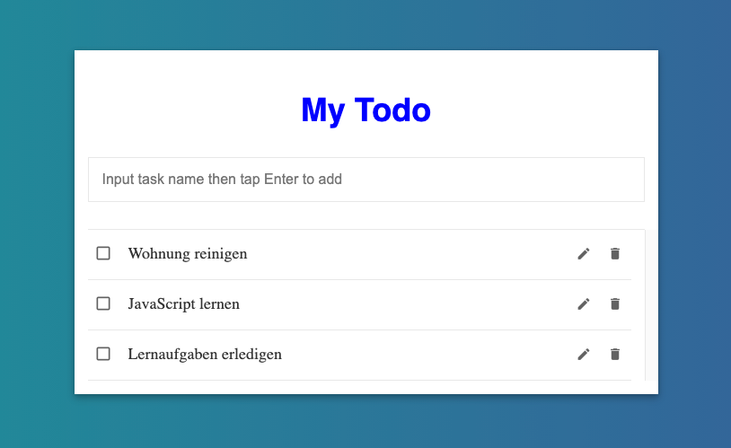
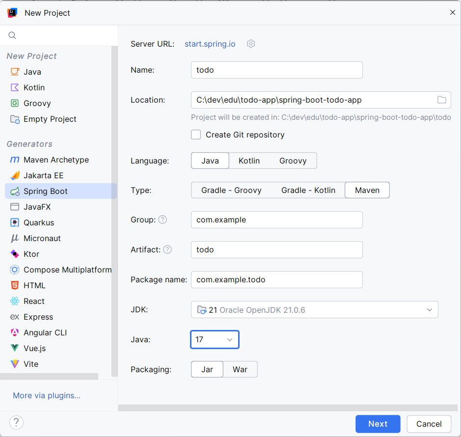
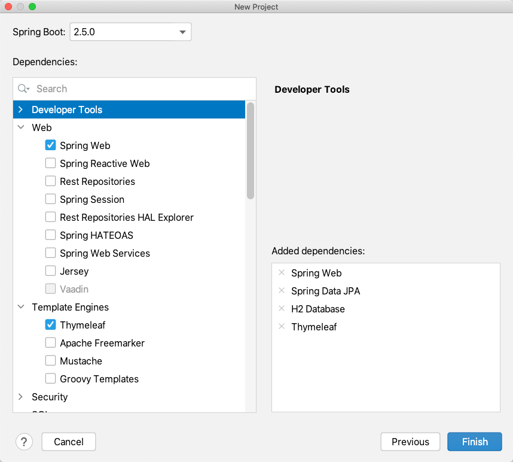
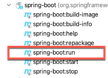
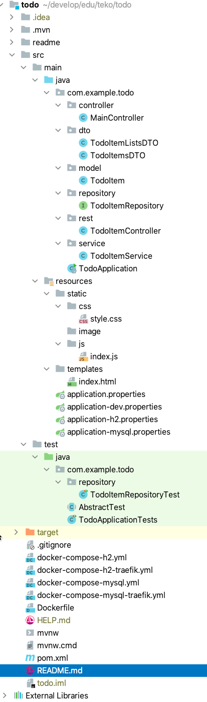
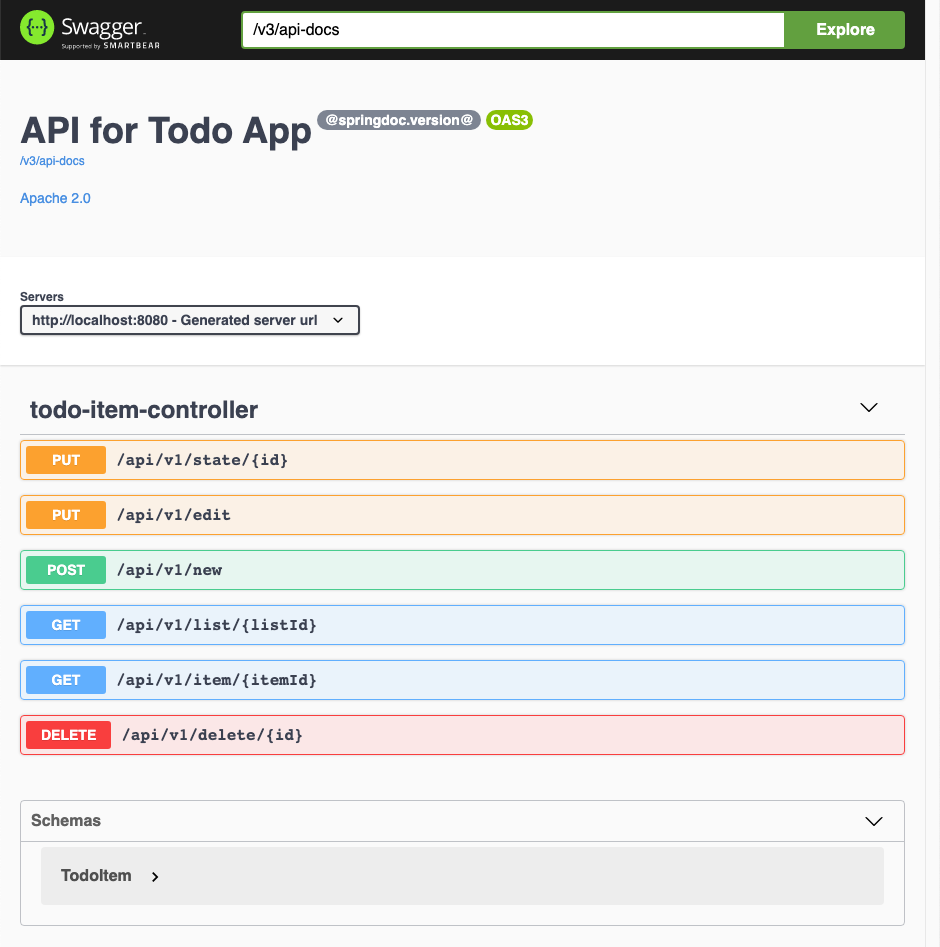

# Todo App Spring Boot Thymeleaf REST jQuery

A single page application by using JSON with jQuery.

Content

- [Setup the project](#setup-spring-initializr)
- [Build the backend](#create-the-data-model)
- [Build the frontend](#implement-client)
- [Deploy the application with docker](#creating-and-deploying-a-container)

## Overview

We will implement simple Todo List app, with client using jQuery and backend use Spring Boot REST APIs.
This tutorial has been adapted from the blog post:

[https://blog.facebit.net/2019/03/25/install-spring-boot-on-mac/](https://blog.facebit.net/2019/03/25/install-spring-boot-on-mac/)

The difference to the original is a changed technology stack.

<br/>



<br/>

## Tools and Technology Stack

the project has been created by using IntelliJ Ultimate edition.
The technology stack consists of the following components:

- Spring Boot (Version 2.5)
- Java Persistence API
- Rest Controller
- Thymeleaf Template Engine
- HTML, CSS, jQuery, Single Page Application
- H2 and MySQL (8.x) Database
- H2 Console
- OpenApi
- Docker and Docker Compose


## Setup Spring Initializr

_IntelliJ IDEA_ provides the _Spring Initializr_ project wizard that integrates with the _Spring Initializr
API_ to generate and import your project directly from the _IDE_.

_Spring Initializr_ generates a valid project structure with the following files:

- A build configuration file, for example, _build.gradle_ for _Gradle_ or _pom.xml_ for _Maven_.
- A class with the _main()_ method to bootstrap the application.
- An empty _JUnit_ test class.
- An empty Spring application configuration file: _application.properties_

Choose Java SDK (can 8, 11, 14, etc):

<br/>



<br />

Choose the dependencies like _Spring Web_, _Spring Data JPA_, _Thymeleaf_ and _SQL H2 Data Base_:

<br/>



<br />

Add the following libraries to the _pom.xml_ file:

```xml
  <dependency>
     <groupId>org.springframework.boot</groupId>
     <artifactId>spring-boot-starter-validation</artifactId>
  </dependency>
     <!-- Open API  -->
  <dependency>
    <groupId>org.springdoc</groupId>
    <artifactId>springdoc-openapi-ui</artifactId>
    <version>1.5.8</version>
  </dependency>
  <dependency>
    <groupId>mysql</groupId>
    <artifactId>mysql-connector-java</artifactId>
    <version>8.0.23</version>
  </dependency>
```

**Do not forget the maven refresh!!**

The spring-boot plugin allows to start the project.

<br/>



<br/>

## The project structure

The structure of the project consists of files for the backend in main/java and files for the web application
in resources. The project has beside the basic profile three additional spring profiles (dev, h2 and mysql).
The _Dockerfile_ allows to create a deployable container. The docker-compose files are demonstrating how to configure  
and orchestrate the containers.

<br/>



<br/>

## Create the Data Model

We can create TodoItem.java as below:

```java
import java.util.Date;
import java.util.UUID;
import javax.persistence.*;
import javax.validation.constraints.NotEmpty;

@Entity
public class TodoItem {
    @Id
    @GeneratedValue(strategy= GenerationType.AUTO)
    private Long itemId;

    private UUID listId;

    @NotEmpty(message="* Enter Task Name")
    private String taskName;

    private Boolean isDone = false; // Default value

    private Date createdAt = new Date();

    public Long getItemId() {
        return itemId;
    }

    public void setItemId(Long itemId) {
        this.itemId = itemId;
    }

    public UUID getListId() {
        return listId;
    }

    public void setListId(UUID listId) {
        this.listId = listId;
    }

    public String getTaskName() {
        return taskName;
    }

    public void setTaskName(String taskName) {
        this.taskName = taskName;
    }

    public Boolean getDone() {
        return isDone;
    }

    public void setDone(Boolean done) {
        isDone = done;
    }

    public Date getCreatedAt() {
        return createdAt;
    }

    public void setCreatedAt(Date createdAt) {
        this.createdAt = createdAt;
    }
}

```

Annotations:

- **@Table**, This annotation specifies the primary table for the annotated entity.
- **@Id**, Specifies database table primary key of a mapped entity.
- **@GeneratedValue**, specification of generation strategies for the values of primary keys. it takes IDENTITY and AUTO as value.
- **@Column**, Specifies database table mapped column for a persistent property or field.
- **@GeneratedType**, Defines the types of primary key generation strategies.
- **@NotEmpty**, The annotated element must not be null nor empty. Supported types are: CharSequence, Collection, Map and Array
- **@Email** The string has to be a well-formed email address.

##  Create the Repository for the model

The query builder mechanism built into Spring Data repository infrastructure is useful for building constraining  
queries over entities of the repository.

Adding TodoItemRepository.java

```java
import java.util.List;
import java.util.UUID;

import com.example.todo.model.TodoItem;
import org.springframework.data.jpa.repository.JpaRepository;
import org.springframework.stereotype.Repository;

@Repository
public interface TodoItemRepository extends JpaRepository<TodoItem, Long> {
    TodoItem findByItemId(Long itemId);
    List<TodoItem> findByListId(UUID listId);
}

```

## Create the Services

Adding TodoItemService.java

```java
import com.example.todo.model.TodoItem;
import com.example.todo.repository.TodoItemRepository;
import org.springframework.beans.factory.annotation.Autowired;
import org.springframework.stereotype.Service;
import java.util.List;
import java.util.UUID;

@Service
public class TodoItemService {

    @Autowired
    private TodoItemRepository todoItemRepository;

    public TodoItem saveTodoItem(TodoItem item) {
        return todoItemRepository.save(item);
    }

    public TodoItem changeDoneStateForTodoItem(Long id) {
        TodoItem item = todoItemRepository.findByItemId(id);
        if (item != null) {
            item.setDone(!item.getDone());
            todoItemRepository.save(item);
            return item;
        }
        return null;
    }

    public Boolean deleteTodoItem(Long id) {
        TodoItem item = todoItemRepository.findById(id).orElse(null);
        if (item != null) {
            todoItemRepository.delete(item);
            return true;
        }
        return false;
    }

    public TodoItem editTodoItem(TodoItem editedItem) {
        TodoItem item = todoItemRepository.findById(editedItem.getItemId()).orElse(null);
        if (item != null) {
            item.setTaskName(editedItem.getTaskName());
            return todoItemRepository.save(item);
        }
        //Create new if we dont have.
        return todoItemRepository.save(item);
    }

    public List<TodoItem> getAllTodoItemsForListId(UUID listId) {
        return todoItemRepository.findByListId(listId);
    }

    public TodoItem getItem(Long id) {
        return todoItemRepository.findByItemId(id);
    }
}

```

## Create the REST Controller

This is REST Controller for CRUD operations of the todo items.

Adding TodoItemController.java

```java
import com.example.todo.model.TodoItem;
import com.example.todo.service.TodoItemService;
import org.springframework.beans.factory.annotation.Autowired;
import org.springframework.http.ResponseEntity;
import org.springframework.web.bind.annotation.*;
import java.util.*;
import org.springframework.web.bind.annotation.PostMapping;
import org.springframework.web.bind.annotation.RequestBody;

@RestController
@RequestMapping("/api/v1")
public class TodoItemController {
    @Autowired
    private TodoItemService todoItemService;

    @GetMapping("/item/{itemId}")
    public TodoItem getItem(@PathVariable Long itemId) {
        return todoItemService.getItem(itemId);
    }

    // Get todo list, based on listId
    @GetMapping("/list/{listId}")
    public List<TodoItem> getItem(@PathVariable UUID listId) {
        return todoItemService.getAllTodoItemsForListId(listId);
    }

    // New todo item
    @PostMapping(value = "/new")
    public ResponseEntity<TodoItem> newTodoItem(@RequestBody TodoItem item) {
        return ResponseEntity.ok(todoItemService.saveTodoItem(item));
    }

    // Edit todo item
    @PutMapping("/edit")
    public ResponseEntity<TodoItem> editTodoItem(@RequestBody TodoItem item) {
        return ResponseEntity.ok(todoItemService.editTodoItem(item));
    }

    // Delete todo item
    @DeleteMapping("/delete/{id}")
    public ResponseEntity<Boolean> deleteTodoItem(@PathVariable Long id) {
        return ResponseEntity.ok(todoItemService.deleteTodoItem(id));
    }

    // Change done state
    @PutMapping("/state/{id}")
    public ResponseEntity<TodoItem> changeDoneState(@PathVariable Long id) {
        return ResponseEntity.ok(todoItemService.changeDoneStateForTodoItem(id));
    }
}

```

Published end points:

- PUT /api/v1/state/{id}
- PUT /api/v1/edit
- POST /api/v1/new
- GET /api/v1/list/{listId}   listId is a uuid eg. 3fa85f64-5717-4562-b3fc-2c963f66afa6
- GET /api/v1/item/{itemId}
- DELETE /api/v1/delete/{id}

## The TodoApplication

We are producing some console output and configuring the openapi.

```java
import io.swagger.v3.oas.models.Components;
import io.swagger.v3.oas.models.OpenAPI;
import io.swagger.v3.oas.models.info.Info;
import io.swagger.v3.oas.models.info.License;
import org.springframework.beans.factory.annotation.Autowired;
import org.springframework.beans.factory.annotation.Value;
import org.springframework.boot.SpringApplication;
import org.springframework.boot.autoconfigure.SpringBootApplication;
import org.springframework.context.annotation.Bean;
import org.springframework.core.env.Environment;

import javax.annotation.PostConstruct;
import java.util.Arrays;

@SpringBootApplication
public class TodoApplication {

    @Autowired
    private Environment env;

    public static void main(String[] args) {
        SpringApplication.run(TodoApplication.class, args);
    }

    @PostConstruct
    public void afterInit() {
        boolean hasDevProfile = Arrays.asList(env.getActiveProfiles()).contains("dev");
        boolean hasH2Database = Arrays.asList(env.getActiveProfiles()).contains("h2");
        String applicationName = env.getProperty("spring.application.name");
        String openApiInfo="";
        String h2ConsoleInfo="";
        if (hasDevProfile) {
            openApiInfo = "http://localhost:8080/v3/api-docs\n" +
                    "http://localhost:8080/v3/api-docs.yaml -> yaml file is downloaded -> https://editor.swagger.io/\n" +
                    "http://localhost:8080/swagger-ui.html \n";
        }
        if (hasH2Database) {
            h2ConsoleInfo= "http://localhost:8080/h2-console  " + "" +
                    "-> mit Generic H2 (Embedded), org.h2.Driver, jdbc:h2:mem:testdb und sa \n";
        }
        System.out.println("\n\nApplication [" + applicationName + "] - Enter in Browser:\nhttp://localhost:8080 \n" +
                openApiInfo +
                h2ConsoleInfo + "\n" +
                "Active Profiles: " + Arrays.toString(env.getActiveProfiles()) + "\n\n");
    }

    @Bean
    public OpenAPI customOpenAPI(@Value("${springdoc.version}") String appVersion) {
        return new OpenAPI()
                .components(new Components())
                .info(new Info().title("API for Todo App").version(appVersion)
                        .license(new License().name("Apache 2.0").url("http://springdoc.org")));
    }

}

```

## Create the Profiles

### Change the application.properties

The _application.properties_ file contains the generic properties. Through the property
_spring.profiles.active=${ACTIVE_PROFILES:dev,h2}_ we can choose which profiles we
want to add.


```properties
spring.profiles.active=${ACTIVE_PROFILES:dev,h2}

spring.application.name=${APP_NAME:Todo Application}

# spring.liquibase.change-log=classpath:/db/changelog/db.changelog-master.yaml

springdoc.api-docs.enabled=true

```

### Create an application-dev.properties

The _application-dev.properties_ consists of the properties for the configuration of the _Spring OpenApi_.

```properties
springdoc.swagger-ui.path=/swagger-ui.html

springdoc.version=@springdoc.version@

springdoc.api-docs.enabled=true

```

### Create an application-h2.properties

The _application-h2.properties_ are configuring the H2 database including the _h2-console_.

```properties
spring.jpa.hibernate.ddl-auto=create-drop
spring.jpa.database-platform=org.hibernate.dialect.H2Dialect
spring.jpa.open-in-view=false
spring.jpa.properties.hibernate.id.new_generator_mappings=false

spring.datasource.driverClassName=org.h2.Driver
# spring.datasource.url=jdbc:h2:file:./data/testdb
spring.datasource.url=jdbc:h2:mem:testdb
spring.datasource.username=sa
spring.datasource.password=

spring.h2.console.enabled=true
spring.h2.console.settings.web-allow-others=true

```
### Create an application-mysql.properties

The _application-mysql.properties_ are configuring the MySql database. The url
contains options to:

- create the database if it is not existing
- allow the public key retrieval (mandatory for MySQL8.x)
- UTF-8 character encoding

```properties
spring.jpa.hibernate.ddl-auto=none
spring.jpa.database-platform=org.hibernate.dialect.MySQL5InnoDBDialect
spring.jpa.open-in-view=false
spring.jpa.properties.hibernate.id.new_generator_mappings=false


spring.datasource.driverClassName=com.mysql.cj.jdbc.Driver
spring.datasource.url=jdbc:mysql://${APP_DB_HOST:localhost}:${APP_DB_PORT:3306}/${APP_DB_NAME:todoapp}?useUnicode=true&characterEncoding=utf8&useSSL=false&allowPublicKeyRetrieval=true&serverTimezone=UTC&useLegacyDatetimeCode=false&createDatabaseIfNotExist=true
spring.datasource.username= ${APP_DB_USERNAME:root}
spring.datasource.password=${APP_DB_PASSWORD:password}
```


## Implement Client

We will use Thymeleaf for rendering client template and using Javascript/jQuery to call REST APIs.
The controller is delivering the index.html. For each new session a unique uuid is created. Each
user gets its onw list.

In controllers folder, adding MainController.java.


```java
import java.util.UUID;
import org.springframework.stereotype.Controller;
import org.springframework.web.bind.annotation.*;
import org.springframework.ui.Model;

@Controller
public class MainController {
    @RequestMapping(value = { "/", "/index" }, method = RequestMethod.GET)
    public String index(Model model)
    {
        // When people visit site, create an UUID for a list and return it.
        UUID uuid = UUID.randomUUID();
        model.addAttribute("listId", uuid.toString());
        return "index";
    }
}

```

Then, adding css file in resource/static/css/style.css.


```css
h1 {
    color:#0000FF;
    font-family: sans-serif;
}

h2 {
    color:#FF0000;
}

table {
    border-collapse: collapse;
}

table th, table td {
    padding: 5px;
}

body {
    font-size: 18px;
    line-height: 1.58;
    background: #6699FF;
    background: -webkit-linear-gradient(to left, #336699, #228899);
    background: linear-gradient(to left, #336699, #228899);
    color: #333;
}

h1 {
    font-size: 36px;
}

* {
    box-sizing: border-box;
}

i {
    vertical-align: middle;
    color: #626262;
}

input {
    border: 1px solid #E8E8E8;
}

.page-title {
    text-align: center;
}

.todo-content {
    max-width: 650px;
    width: 100%;
    margin: 0 auto;
    margin-top: 60px;
    background-color: #fff;
    padding: 15px;
    box-shadow: 0 0 4px rgba(0,0,0,.14), 0 4px 8px rgba(0,0,0,.28);
}

.form-control {
    font-size: 16px;
    padding-left: 15px;
    outline: none;
    border: 1px solid #E8E8E8;
}

.form-control:focus {
    border: 1px solid #626262;
}

.todo-content .form-control {
    width: 100%;
    height: 50px;
}

.todo-content .todo-create {
    padding-bottom: 30px;
    border-bottom: 1px solid #e8e8e8;
}

.todo-content .alert-danger {
    padding-left: 15px;
    font-size: 14px;
    color: red;
    padding-top: 5px;
}

.todo-content ul {
    list-style: none;
    margin: 0;
    padding: 0;
    max-height: 450px;
    padding-left: 15px;
    padding-right: 15px;
    margin-left: -15px;
    margin-right: -15px;
    overflow-y: scroll;
}

.todo-content ul li {
    padding-top: 10px;
    padding-bottom: 10px;
    border-bottom: 1px solid #E8E8E8;
}

.todo-content ul li span {
    display: inline-block;
    vertical-align: middle;
}

.todo-content .todo-title {
    width: calc(100% - 160px);
    margin-left: 10px;
    overflow: hidden;
    text-overflow: ellipsis;
}

.todo-content .todo-completed {
    display: inline-block;
    text-align: center;
    width:35px;
    height:35px;
    cursor: pointer;
}

.todo-content .todo-completed i {
    font-size: 20px;
}

.todo-content .todo-actions, .todo-content .edit-actions {
    float: right;
}

.todo-content .todo-actions i, .todo-content .edit-actions i {
    font-size: 17px;
}

.todo-content .todo-actions a, .todo-content .edit-actions a {
    display: inline-block;
    text-align: center;
    width: 35px;
    height: 35px;
    cursor: pointer;
}

.todo-content .todo-actions a:hover, .todo-content .edit-actions a:hover {
    background-color: #f4f4f4;
}

.todo-content .todo-edit input {
    width: calc(100% - 80px);
    height: 35px;
}
.todo-content .edit-actions {
    text-align: right;
}

.no-todos {
    text-align: center;
}

.toggle-completed-checkbox:before {
    content: 'check_box_outline_blank';
}

li.completed .toggle-completed-checkbox:before {
    content: 'check_box';
}

li.completed .todo-title {
    text-decoration: line-through;
    color: #757575;
}

li.completed i {
    color: #757575;
}

```

Then, adding JavaScript file in resource/static/js/index.js.

```javascript
/**
 * Handles the keyboard event. In case of ENTER (13) it saves a new todoItem or updates
 * an existing one
 * @param e keyboard event
 */
function handleEnterKey(e) {
    if (e.keyCode === 13) {
        e.preventDefault(); // Ensure it is only this code that run
        let taskName = document.getElementById('taskNameTextField').value
        // Clear input field!
        let taskNameTextField = $("#taskNameTextField");
        taskNameTextField.val('');

        // Check if we are editing or not!
        let isEditing = taskNameTextField.attr("isEditing");

        if (isEditing) {
            // clear editing flag.
            taskNameTextField.removeAttr("isEditing");
            let itemId = taskNameTextField.attr("editingItemId");
            taskNameTextField.removeAttr("editingItemId");
            putEditTodoItem(itemId, taskName, glistId);
        } else {
            postNewTodoItem(taskName, glistId);
        }
    }
}

/**
 * Handles the change of the todoItem status
 * @param ele the todoItem
 */
function changeDoneState(ele) {
    let itemId = $(ele).attr("id"); // get the item id!
    $.ajax({
        type: "PUT",
        url: "/api/v1/state/" + itemId,
        success: function (data) {
            // Create new list item
            let newListItem = $('<li/>')
                .attr("id", "item" + data.itemId);

            if (data.done) {
                newListItem.addClass('completed')
            }

            createTodoRow(newListItem, data);

            // Replace the old one by the new one
            let oldListItem = $("#item" + itemId);
            oldListItem.replaceWith(newListItem);
        },
        error: function (data) {
        }
    });
}

/**
 * Updates an existing todoItem in terms of taskName. The old item
 * is replaced in the todoList by the newItem from the backend.
 * @param itemId    the todoItem id
 * @param taskName  the name of the task to do
 * @param listId    the listId as UUID
 */
function putEditTodoItem(itemId, taskName, listId) {
    let todoItem = {
        itemId: itemId,
        taskName: taskName,
        listId: listId
    };
    let requestJSON = JSON.stringify(todoItem);
    $.ajax({
        type: "PUT",
        url: "/api/v1/edit",
        headers: {
            "Content-Type": "application/json"
        },
        data: requestJSON,
        success: function (data) {
            // Create new list item
            let newListItem = $('<li/>')
                .attr("id", "item" + data.itemId);

            if (data.done) {
                newListItem.addClass('completed')
            }

            createTodoRow(newListItem, data);

            // Replace the old one by the new one
            let oldListItem = $("#item" + data.itemId);
            oldListItem.replaceWith(newListItem);
        },
        error: function (data) {
        }
    });
}

/**
 * Saves a new todoItem in the backend and creates a list item in the ul list
 * @param taskName the entered task name
 * @param listId   the unique list id with an UUID
 */
function postNewTodoItem(taskName, listId) {
    let newTodoItem = {
        taskName: taskName,
        listId: listId
    };
    let requestJSON = JSON.stringify(newTodoItem);
    $.ajax({
        type: "POST",
        url: "/api/v1/new",
        headers: {
            "Content-Type": "application/json"
        },
        data: requestJSON,
        success: function (data) {
            let cList = $('ul.todo-list');
            let li = $('<li/>')
                .attr("id", "item" + data.itemId)
                .appendTo(cList);

            createTodoRow(li, data);
        },
        error: function (data) {
        }
    });
}

/**
 * Deletes a todoItem in the backend and deletes it from the list
 * @param ele the list todoItem
 */
function deleteTodoItem(ele) {
    let itemId = $(ele).attr("id"); // get the item id!
    $.ajax({
        type: "DELETE",
        url: "/api/v1/delete/" + itemId,
        success: function (data) {
            let oldItem = $("#item" + itemId);
            cuteHide(oldItem);
        },
        error: function (data) {
        }
    });
}

/**
 * Take the taskName ("todoTitle") from the list and copy it the the taskNameTextField
 * @param ele the edit a-tag from the list todoItem
 */
function editTodoItem(ele) {
    // first get item id
    let itemId = $(ele).attr("id");
    // then get list item we created before.
    let listItem = $("#item" + itemId);
    let titleSpan = listItem.find(".todo-title");

    // set the text field
    let taskNameTextField = $("#taskNameTextField");
    taskNameTextField.val(titleSpan.text());
    // set the attribute that we are editing!
    taskNameTextField.attr("isEditing", true);
    taskNameTextField.attr("editingItemId", itemId);
}

/**
 * Creates a row in the todoList
 * The line consists of an id, checkbox, task name, a span with edit icon and delete icon
 * @param parent
 * @param data
 */
function createTodoRow(parent, data) {
    let todoRow = $('<div/>')
        .addClass('todo-row')
        .appendTo(parent)

    // Check BOX
    let checkBoxAttr = $('<a/>')
        .attr("id", data.itemId) // to know item id!
        .attr("onclick", "changeDoneState(this)")
        .addClass('todo-completed')
        .appendTo(todoRow);

    let checkBoxIcon = $('<i/>')
        .addClass('material-icons toggle-completed-checkbox')
        .appendTo(checkBoxAttr);

    // Task Name
    let todoTitle = $('<span/>')
        .addClass('todo-title')
        .text(data.taskName)
        .appendTo(todoRow);

    // Actions
    let todoActions = $('<span/>')
        .addClass('todo-actions')
        .appendTo(todoRow)

    // Edit icon
    let editAttr = $('<a/>')
        .attr("id", data.itemId) // to know item id!
        .attr("onclick", "editTodoItem(this)")
        .appendTo(todoActions);

    let editIcon = $('<i/>')
        .addClass('material-icons')
        .text('edit')
        .appendTo(editAttr);

    // Delete icon
    let deleteAttr = $('<a/>')
        .attr("id", data.itemId) // to know item id!
        .attr("onclick", "deleteTodoItem(this)")
        .appendTo(todoActions);

    let deleteIcon = $('<i/>')
        .addClass('material-icons')
        .text('delete')
        .appendTo(deleteAttr);
}

/**
 * For animation during delete
 * @param el the li element
 */
function cuteHide(el) {
    el.animate({opacity: '0'}, 300, function () {
        el.animate({height: '0px'}, 300, function () {
            el.remove();
        });
    });
}

```

Finally, we implement HTML file called _index.html_ in _resources/templates/index.html_.

```html
<!DOCTYPE HTML>
<html xmlns:th="http://www.thymeleaf.org">

<head>
    <meta charset="UTF-8"/>
    <title>Create and share a check list just a second! Publist - Never miss a thing!</title>
    <link rel="stylesheet" type="text/css" th:href="@{/css/style.css}"/>

    <!--For jquery calling REST API-->
    <script src="https://ajax.googleapis.com/ajax/libs/jquery/2.1.1/jquery.min.js"></script>
    <!--For material icon-->
    <link rel="stylesheet" href="https://fonts.googleapis.com/icon?family=Material+Icons">
    <script src="/js/index.js"></script>
</head>

<body>

<div class="todo-content">
    <h1 class="page-title"> My Todo </h1>

    <div class="todo-create">
        <!--Create a text box and handle ENTER to create item-->
        <form action="#">
            <input type="text" id="taskNameTextField" class="form-control" onkeypress="handleEnterKey(event)"
                   placeholder="Input task name then tap Enter to add">
        </form>
    </div>

    <!-- contains the list with the todoItems -->
    <ul class="todo-list">
    </ul>

    <!-- First grab an UUID from backend ... listId is added at Java MainController -->
    <script th:inline="javascript">
        /*<![CDATA[*/
        let glistId = /*[[${listId}]]*/
        /*]]>*/
    </script>
</div>
</body>

</html>

```

## Starting the Application

After starting the application, you have several options:

Todo Application - Enter in Browser:

- [http://localhost:8080](http://localhost:8080) Open the _Todo App_ in the browser
- [http://localhost:8080/v3/api-docs](http://localhost:8080/v3/api-docs) The _Api-Docs_ in _JSON_ format
- [http://localhost:8080/v3/api-docs.yaml](http://localhost:8080/v3/api-docs.yaml) -> _yaml_ file is downloaded -> [https://editor.swagger.io/](https://editor.swagger.io/)
- [http://localhost:8080/swagger-ui.html](http://localhost:8080/swagger-ui.html) The _OpenApi_ Frontend
- [http://localhost:8080/h2-console](http://localhost:8080/h2-console)  -> mit Generic _H2_ (Embedded), _org.h2.Driver_, **jdbc:h2:mem:testdb** und sa

### OpenApi Frontend for API Testing

<br/>



<br/>

### H2 Console

<br/>


<br/>

## Creating and deploying a container

### Build run and publish the todo-app project

Use a Mac, Linux, WSL2 or git bash console.

<br/>

```
git clone https://github.com/mbachmann/spring-boot-todo-app
cd file-system-storage
git checkout docker
./mvnw clean package
java -jar target/todo*.jar
```

<br/>

###  Create a Docker Container, Run and Publish to Docker

Create first a jar with the build instruction. To create a container. Replace **uportal** with your **dockerhub id**.

<br/>

```

$  docker build -t uportal/todo-app .
$  docker run -p 8080:8080 --rm -it  uportal/todo-app
```

<br/>

_Ctrl c_ will stop and delete the container.

<br/>

Replace **uportal** with your **dockerhub id**.

<br/>

```
$  docker login
$  docker login --username uportal --password 
$  docker push uportal/todo-app
```
<br/>

Login to deployment platform with a container infrastructure:

<br/>

Replace **uportal** with your **dockerhub id**.

<br/>

```
$  docker pull uportal/todo-app
```

<br/>

###  docker-compose

Start the files with:

<br/>

Start with log output in the console:

```
$  docker-compose -f docker-compose-h2.yml up
```

<br/>

Start in detached mode

```
$  docker-compose -f docker-compose-h2.yml up -d
```

<br/>

Delete containers:

```
$  docker-compose -f docker-compose-h2.yml rm
```

<br/>

### Create a Dockerfile

The Dockerfile takes a slim _JDK11 image_, adds the _todo-*.jar_ file from the _target_ folder with the name _app.jar_. This jar file is started by _java -jar_ command.

<br/>

```dockerfile
FROM openjdk:11-jdk-slim

ADD target/todo-*.jar app.jar

ARG JVM_OPTS
ENV JVM_OPTS=${JVM_OPTS}

CMD java ${JVM_OPTS} -jar app.jar

```

<br/>

### Create a docker-compose-h2.yml file

The _docker-compose-h2.yml_ contains one service with the name _todo-app-h2_. The environment variables are used for defining the application name and with active spring profiles.

Replace **uportal** with your **dockerhub id**.

<br/>

```yaml

version: '2'

services:

  todo-app-h2:
    image: uportal/todo-app:latest

    restart: always
    environment:
      APP_NAME: Todo App with H2
      ACTIVE_PROFILES: dev,h2
    ports:
      - 8080:8080

```

<br/>

### Create a docker-compose-mysql.yml file

The _docker-compose-h2.yml_ contains three services:

- todo-app-mysql: our todo-app spring application listening at the host port 8080
- adminer: a database manager for the mysql database listening at the host port 9090
- dbmysql8: a mysql database instance listening at the host port 33066


Replace **uportal** with your **dockerhub id**.

<br/>

```yaml
version: '3'

services:

  todo-app-mysql:
    image: uportal/todo-app:latest

    restart: always
    environment:
      APP_NAME: Todo App with MySQL
      ACTIVE_PROFILES: dev,mysql
      APP_DB_HOST: dbmysql8-todoappdb
      APP_DB_PORT: 3306
      APP_DB_NAME: todoapp
      APP_DB_USERNAME: root
      APP_DB_PASSWORD: todoapp
    ports:
      - 8080:8080

  adminer:
    image: adminer:4.8.0
    restart: always
    ports:
      - 9090:8080
    environment:
      ADMINER_DEFAULT_SERVER: dbmysql8-todoappdb

  dbmysql8:
    image: mysql:8.0.23
    command: --default-authentication-plugin=mysql_native_password
    container_name: dbmysql8-todoappdb
    restart: always
    cap_add:
      - SYS_NICE
    environment:
      MYSQL_DATABASE: 'todoapp'
      # So you don't have to use root, but you can if you like
      MYSQL_USER: 'user'
      # You can use whatever password you like
      MYSQL_PASSWORD: 'todoapp'
      # Password for root access
      MYSQL_ROOT_PASSWORD: 'todoapp'
    ports:
      # <Port exposed> : < MySQL Port running inside container>, host port for using with mysql-workbench or dbeaver
      - '33066:3306'
    expose:
      # Opens port 3306 on the container
      - '3306'
      # Where our data will be persisted
    volumes:
      - dbmysql8-todoappdb:/var/lib/mysql
# Names our volume
volumes:
  dbmysql8-todoappdb:

```

<br/>

### Create a docker-compose-h2-traefik.yml file

The _docker-compose-h2.yml_ contains one service with the name _todo-app-h2_. The environment variables are used for defining the application name and with active spring profiles.
The service registers at the _traefik reverse proxy_ and is available under the url: _todo-app-h2.united-portal.com_.

Replace **uportal** with your **dockerhub id**.

<br/>

```yaml
version: '2'


networks:
  proxy:
    external: true

services:

  todo-app-h2:
    image: uportal/todo-app:latest
    labels:
      - "traefik.backend=todo-app-h2"
      - "traefik.frontend.rule=Host:todo-app-h2.united-portal.com"
      - "traefik.docker.network=proxy"
      - "traefik.port=8080"
      - "traefik.enable=true"

    restart: always
    networks:
      - proxy
    environment:
      APP_NAME: Todo App with H2
      ACTIVE_PROFILES: dev,h2


```

<br/>


