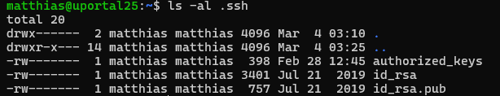
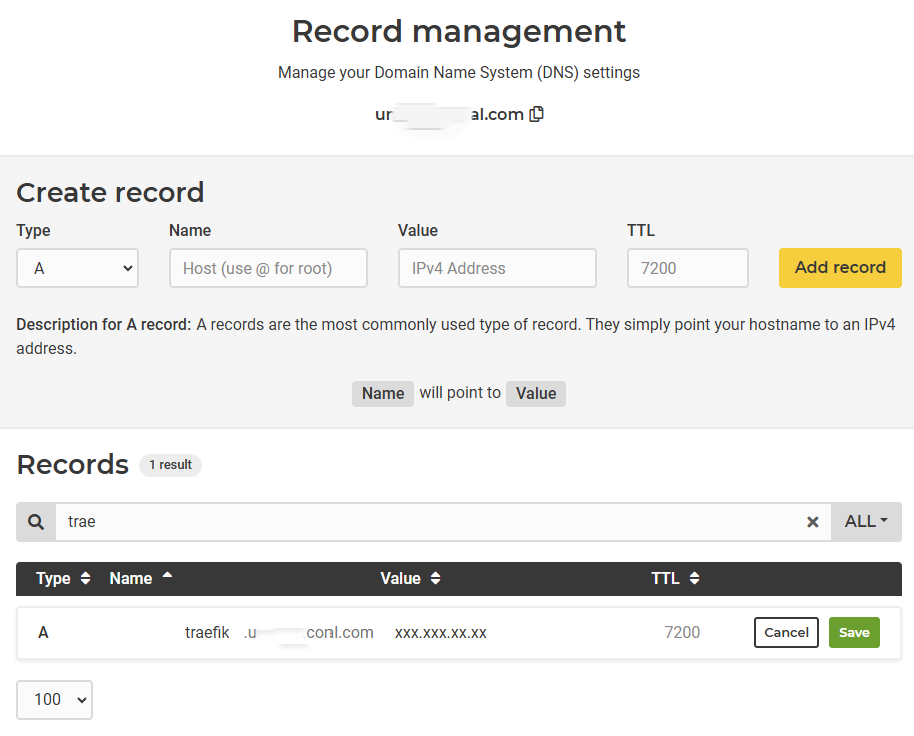
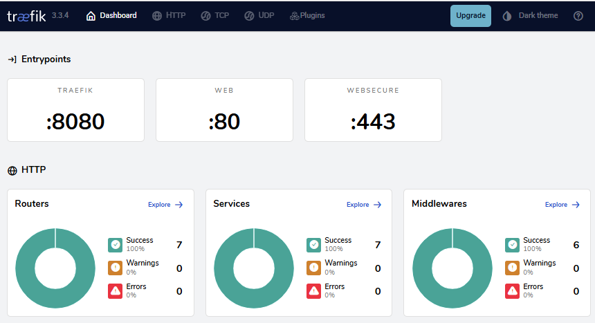
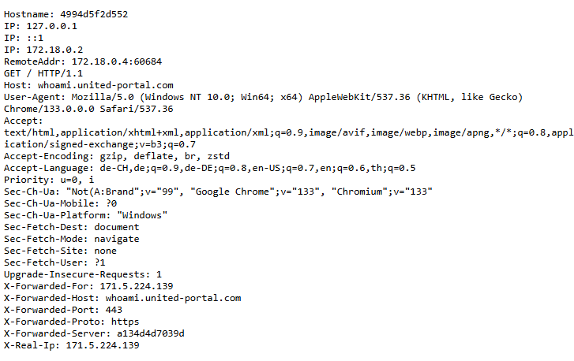

# Install Docker and Traefik on Ubuntu

## Postinstallation steps for Ubuntu 

https://community.hetzner.com/tutorials/howto-initial-setup-ubuntu

1. Setup a non root user using the decription above.

For a manual copy of authoried keys use the following command:
https://developers.redhat.com/blog/2018/11/02/how-to-manually-copy-ssh-keys-rhel

```bash
$ mkdir ~/.ssh/
$ chmod 700 ~/.ssh  # this is important.
$ touch ~/.ssh/authorized_keys
$ chmod 600 ~/.ssh/authorized_keys  #this is important.

$ cat /root/.ssh/authorized_keys > ~/.ssh/authorized_keys
```  

You can copy your personal ssh keys id_rsa and id_rsa.pub to the new user folder .ssh

Make sure that the user folder .ssh has the right permissions:





2. Setup the firewall for port 80 and 443

```bash
sudo ufw allow 80
sudo ufw allow 443
```

## Install Docker on Ubuntu

1. Set up Docker's apt repository.

```bash
# Add Docker's official GPG key:
sudo apt-get update
sudo apt-get install ca-certificates curl
sudo install -m 0755 -d /etc/apt/keyrings
sudo curl -fsSL https://download.docker.com/linux/ubuntu/gpg -o /etc/apt/keyrings/docker.asc
sudo chmod a+r /etc/apt/keyrings/docker.asc

# Add the repository to Apt sources:
echo \
  "deb [arch=$(dpkg --print-architecture) signed-by=/etc/apt/keyrings/docker.asc] https://download.docker.com/linux/ubuntu \
  $(. /etc/os-release && echo "${UBUNTU_CODENAME:-$VERSION_CODENAME}") stable" | \
  sudo tee /etc/apt/sources.list.d/docker.list > /dev/null
sudo apt-get update

```

2. Install Docker.

To install the latest version, run:

```bash
sudo apt-get install docker-ce docker-ce-cli containerd.io docker-buildx-plugin docker-compose-plugin
```

3. Verify that the installation is successful by running the hello-world image:

```bash
sudo docker run hello-world
``` 

## Manage Docker as a non-root user
The Docker daemon binds to a Unix socket, not a TCP port. 
By default it's the root user that owns the Unix socket, 
and other users can only access it using sudo. 
The Docker daemon always runs as the root user.

If you don't want to preface the docker command with sudo, 
create a Unix group called docker and add users to it. 
When the Docker daemon starts, it creates a Unix socket accessible 
by members of the docker group. 
On some Linux distributions, the system automatically 
creates this group when installing Docker Engine using a 
package manager. In that case, 
there is no need for you to manually create the group.

To create the docker group and add your user:

1. Create the docker group.

```bash
sudo groupadd docker
```


2. Add your user to the docker group.

```bash
sudo usermod -aG docker $USER
```

3. Log out and log back in so that your group membership is re-evaluated.


4. Verify that you can run docker commands without sudo.

```bash
docker run hello-world
``` 

If you initially ran Docker CLI commands using sudo before adding your user to the docker group, 
you may see the following error:

`WARNING: Error loading config file: /home/user/.docker/config.json -
stat /home/user/.docker/config.json: permission denied`

This error indicates that the permission settings for the ~/.docker/ directory are incorrect, 
due to having used the sudo command earlier.

To fix this problem, either remove the ~/.docker/ directory 
(it's recreated automatically, but any custom settings are lost), 
or change its ownership and permissions using the following commands:

```bash
sudo chown "$USER":"$USER" /home/"$USER"/.docker -R
sudo chmod g+rwx "$HOME/.docker" -R
``` 

## Configure Docker to start on boot with systemd
Many modern Linux distributions use systemd to manage which services start when the system boots. On Debian and Ubuntu, the Docker service starts on boot by default. To automatically start Docker and containerd on boot for other Linux distributions using systemd, run the following commands:

```bash
sudo systemctl enable docker.service
sudo systemctl enable containerd.service
``` 

To stop this behavior, use disable instead.

```bash
sudo systemctl disable docker.service
sudo systemctl disable containerd.service
``` 

## Reboot your system to test that the Docker service starts automatically.

```bash
sudo reboot now
```

## Install Traefik

1. Create a directory for the Traefik configuration.

```bash
mkdir ~/traefik
cd ~/traefik
```


2. Create a Docker network for Traefik.

```bash
docker network create proxy
docker network create localnet
```

3. Create a configuration file named traefik.yml.

```bash
touch traefik.yml
nano traefik.yml
```
Copy paste the content of the file traefik.yml from this repository.

4. Create a configuration file named traefik_dynamic.yml.

```bash
touch traefik_dynamic.yml
nano traefik_dynamic.yml
```
Copy paste the content of the file traefik_dynamic.yml from this repository.

5. Create a docker-compose.yml file.

```bash
touch docker-compose.yml
nano docker-compose.yml
```

Copy paste the content of the file docker-compose.yml from this repository.

6. Adjust the domain name in the docker-compose.yml file.
```yaml
- "traefik.http.routers.traefik.rule=Host(`traefik.example.com`)" # change hostname!
```

Create a password for the Traefik dashboard.

```bash
sudo apt-get install apache2-utils
htpasswd -Bnb username password | sed -e s/\\$/\\$\\$/g
```

Copy the output and paste it into the docker-compose.yml file.

```yaml
- "traefik.http.middlewares.traefik-auth.basicauth.users=admin:create-password" # change username and password!
```


7. Adjust the email address in the traefik.yml file.

```yaml
certificatesResolvers:
  lets-encrypt:
    acme:
      email: john-doe@example.com # change email!
```

8. Start Traefik.

```bash
docker compose up -d
```

9. Verify that Traefik is running.

```bash
docker ps
```

10. Access the Traefik dashboard.

Add your url to the provider DNS management. E.g. Hetzner DNS management.
The url must point to the IP address of the server where Traefik is running.

https://dns.hetzner.com/zone/....




11. Open a web browser and navigate to the following URL:

https://traefik.host-name.com/dashboard/  # change hostname!



Access the Traefik dashboard with the username and password you created earlier.

12. Create a new whoami Docker container.

```bash
touch docker-compose-whoami.yml
nano docker-compose-whoami.yml
``` 

Copy paste the content of the file docker-compose-whoami.yml from this repository.

13. Start the whoami container.

Add the dns name to the docker-compose-whoami.yml file.

```yaml
- "traefik.http.routers.whoami.rule=Host(`whoami.example.com`)" # change hostname!
```

Add the dns name to your provider DNS management.

```bash
docker compose -f docker-compose-whoami.yml up -d
```

14. Access the whoami container.

Open a web browser and navigate to the following URL: 

https://whoami.example.com/  # change hostname!

You should see the following output:



